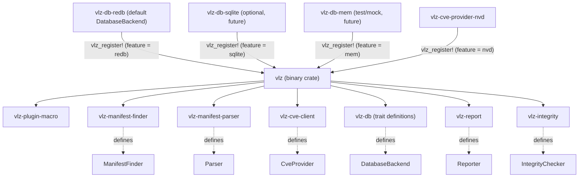
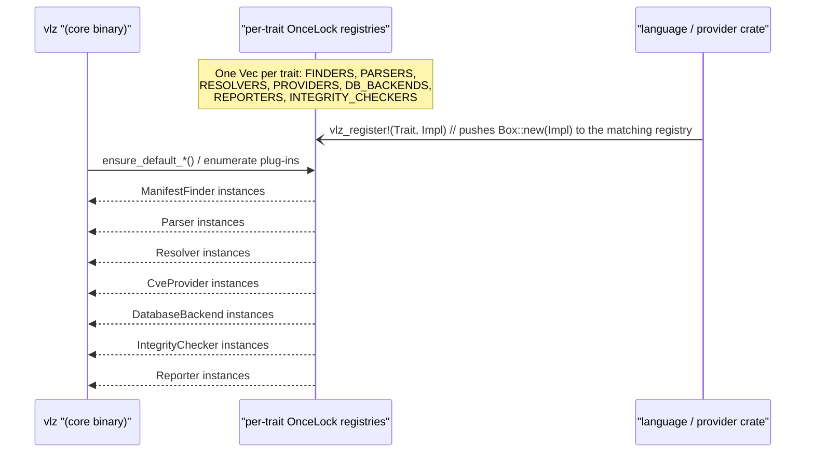

<!--
SPDX-FileCopyrightText: 2026 Travis Post <post.travis@gmail.com>

SPDX-License-Identifier: GPL-3.0-or-later
-->

# Contributing to verilyze

Thank you for your interest in contributing. This document gives a short
overview of the crate layout and extension points.

## Crate architecture

Crates are organized by plugin type under `crates/`:

- **crates/core/** -- Binary and trait-defining crates:
  - **vlz** -- Binary; parses CLI, loads config, dispatches subcommands, runs the
    scan pipeline.
  - **vlz-db** -- Trait definitions: `Package`, `CveRecord`, `DatabaseBackend`, etc.
  - **vlz-manifest-finder** -- Trait `ManifestFinder`; no default implementation.
  - **vlz-manifest-parser** -- Traits `Parser` and `Resolver`; defines
    `DependencyGraph`; no default implementations.
  - **vlz-cve-client** -- Trait `CveProvider` and `RawVulnDecoder`; defines the
    provider contract and decoder registry; includes default OSV.dev client.
  - **vlz-report** -- Trait `Reporter`; plain, JSON, HTML, SARIF, CycloneDX, SPDX
    reporters.
  - **vlz-integrity** -- Trait `IntegrityChecker`; default delegates to backend
    `verify_integrity`.
  - **vlz-plugin-macro** -- `vlz_register!` macro for registering default plugins
    in the binary.
- **crates/languages/** -- Language plugins (ManifestFinder, Parser, Resolver):
  - **vlz-python** -- Python: requirements.txt, pyproject.toml, Pipfile, etc.
  - **vlz-rust** -- Rust: Cargo.toml, Cargo.lock (workspace members supported).
- **crates/providers/** -- CVE providers (optional, feature-gated):
  - **vlz-cve-provider-nvd** -- NVD (NIST); `nvd` feature.
  - **vlz-cve-provider-github** -- GitHub Advisory Database; `github` feature.
  - **vlz-cve-provider-sonatype** -- Sonatype OSS Index; `sonatype` feature.
- **crates/db-backends/** -- Database backend implementations:
  - **vlz-db-redb** -- Default RedB implementation for CVE cache and
    false-positive (ignore) DB.

The binary uses **per-trait registries** (e.g. `FINDERS`, `PARSERS`,
`RESOLVERS`, `PROVIDERS`, `DB_BACKENDS`, `REPORTERS`, `INTEGRITY_CHECKERS`) and
calls `ensure_default_*` at startup to push default implementations. Language
support (e.g. `vlz-python`) and optional backends (e.g. SQLite) are gated
behind Cargo features; see **Feature gating** below.

See [execution-flow.mmd](architecture/execution-flow.mmd) for the full scan
pipeline.



## Quick setup

**Required system dependencies (install before `make setup`)**

| Dependency         | Purpose                                    | Install                      |
| ------------------ | ------------------------------------------ | ---------------------------- |
| Rust, Cargo        | Build and test                             | [rustup](https://rustup.rs/) |
| C toolchain/linker | Link Rust crates on build (GCC/clang)      | OS package manager           |
| Python 3 (≥3.11)   | Scripts, linters, tests                    | OS package manager           |
| ShellCheck         | Shell script linting                       | OS package manager           |
| GNU Make (4.0+)    | Build orchestration                        | OS package manager           |
| Git                | Contributing, hooks, fuzz change detection | OS package manager           |
| GnuPG 2.x/SSH key  | Commit signing (GPG or SSH; required)      | OS package manager           |

**Auto-installed by `make setup` (when missing)**

| Dependency               | Purpose                                | Installed by |
| ------------------------ | -------------------------------------- | ------------ |
| cargo-deny               | `make deny-check` / `make check`       | `make setup` |
| cargo-about              | `make check-third-party-licenses`      | `make setup` |
| cargo-llvm-cov           | Coverage (`make coverage*`)            | `make setup` |
| cargo-afl                | Fuzzing (`make fuzz*`)                 | `make setup` |
| pytest/pytest-cov        | Script tests (`make test-scripts`)     | `make setup` |
| black/pylint/mypy/bandit | Python lint (`make lint-python`)       | `make setup` |

**Recommended system dependencies**

| Dependency | Purpose                                | Install                                             |
| ---------- | -------------------------------------- | --------------------------------------------------- |
| AFL++      | Fuzzing (`make fuzz`, `make coverage`) | [AFL++](https://github.com/AFLplusplus/AFLplusplus) |

**Preferred linker policy**

- Default linker profile for this project: **gcc + GNU ld (`ld.bfd`)**.
- The Makefile sets default env values (`CC`, `RUSTFLAGS`) with `?=`,
  so users can override per command:
  - `CC=clang RUSTFLAGS="-Clink-arg=-fuse-ld=lld" make debug`
  - `CC=clang make check-fast`
- Coverage fallback remains available: `VLZ_COVERAGE_USE_BFD=1` enforces
  `-fuse-ld=bfd` for coverage runs (see [Running tests and coverage](#running-tests-and-coverage)).
- Typical first-time installs:
  - Debian/Ubuntu: `sudo apt install build-essential gcc binutils`
  - Fedora: `sudo dnf install gcc binutils`
  - openSUSE: `sudo zypper install gcc binutils`

After installing dependencies and cloning, run:

```sh
make setup
make -j check
```

End-user install options (release binary, `make install`, packages, Docker):
see [INSTALL.md](INSTALL.md).

Run `make` or `make help` for a full list of targets. `make setup` checks
system prerequisites (`python3`, `cargo`, `shellcheck`) and bootstraps
non-system developer tools (cargo-deny, cargo-about, cargo-llvm-cov,
cargo-afl, Python lint/test venvs). REUSE is auto-installed when
`check-headers` runs. Recommended: `make setup-hooks` for git hooks (REUSE
headers, DCO signoff, signature verification on push). Commit signing (GPG or
SSH) must be configured separately -- see
[Commit signing setup](#commit-signing-setup). For fuzz, AFL++ must be
installed separately. For coverage, use stable Rust with
`rustup component add llvm-tools` (CI installs this on stable).

### Quick reference

| Workflow              | Target                                             |
|-----------------------|----------------------------------------------------|
| List all targets      | `make` / `make help`                               |
| Bootstrap environment | `make setup`                                       |
| Full CI check         | `make check` (use `make -j check` for faster runs) |
| Quick build           | `make debug`                                       |
| Release build         | `make release` (stripped binary, NFR-023)          |
| Run tests             | `make unit-tests`                                  |
| Format Rust code      | `make fmt`                                         |
| Verify Rust format    | `make fmt-check`                                   |
| Run Clippy lints      | `make clippy`                                      |
| Dependency policy     | `make deny-check` (`cargo deny check`)             |
| Coverage (with fuzz)  | `make coverage`                                    |
| Coverage (skip fuzz)  | `make coverage-quick`                              |
| Fuzz smoke test       | `make fuzz`                                        |
| Fuzz changed only     | `make fuzz-changed`                                |
| Fuzz extended         | `make fuzz-extended`                               |
| Check DCO signoff     | `make check-dco`                                   |
| Check signatures      | `make check-signatures`                            |

## Branching and merging

We use trunk-based development with short-lived feature branches and rebased
branches. `main` is always buildable, tested, and releasable.

**Workflow:**

1. Create a branch from `main`:
   `git checkout main && git pull && git checkout -b feature/xyz` (or
   `fix/description` for bug fixes).
2. Work and commit. Keep branches short-lived and focused.
3. Before opening or updating a PR, rebase onto `main`:
   `git fetch origin main && git rebase origin/main`
4. Push: `git push --force-with-lease` (required after rebase).
5. Merge via GitHub's "Create a merge commit" button. All PRs must be
   rebased onto `main` before merging so the merge commit introduces no
   divergence.

We use merge commits instead of rebase-merge or squash-merge because GitHub's
rebase-merge [strips GPG signatures](https://github.com/orgs/community/discussions/11639)
from commits (leaving them unsigned), and squash-merge replaces them with
GitHub's own signature. Merge commits preserve the original signed commits.
Use `git log --first-parent` for a linear view of `main`.

### Commit messages

We use [Conventional Commits](https://www.conventionalcommits.org/). Format:

- **Subject:** `<type>[optional scope]: <description>` (e.g.
  `fix(parser): handle empty manifest`, `docs: add commit conventions`).
- **Subject line length:** 50 characters or less.
- **Body:** Optional for trivial changes, but required for any non-trivial
  changes. When adding a body, wrap lines at 72 characters.
- **DCO signoff:** All commits must include a `Signed-off-by` line attesting
  to the [Developer Certificate of Origin](https://developercertificate.org/).
  Use `git commit -s` to add it automatically. CI will reject PRs whose commits
  lack a valid signoff.
- **Commit signing (required):** All commits must be cryptographically
  signed (GPG or SSH). Use `git config commit.gpgsign true` to enable
  automatic signing. This is why squash and rebase merges are disabled --
  both strip contributor signatures. See [Commit signing setup](#commit-signing-setup)
  below for step-by-step instructions.

**Branch protection (GitHub):** Configure branch protection for `main` to
require PR reviews, passing CI, require signed commits, and disallow
force-push to `main`. Under Settings > General > Pull Requests, enable only
"Allow merge commits" and disable "Allow squash merging" and "Allow rebase
merging" so that the only available merge method preserves signatures.

**Super-linter / commitlint:** [`.commitlintrc.json`](.commitlintrc.json) extends
`@commitlint/config-conventional` (bundled in the super-linter image). With
`defaultIgnores: true`, merge commits such as GitHub’s `Merge pull request …`
and `Merge branch …` are skipped so only normal commits are checked against
Conventional Commits. Subject length in commitlint follows the conventional
preset (stricter than the 50-character guideline above); the 50-character rule
remains the project convention for authors.

### Commit signing setup

All commits must be signed. Git supports two signing backends; both are
equally accepted by the project's checks (`make check-signatures`, the
pre-push hook, and CI). Choose whichever suits your workflow.

**Option A: GPG signing**

1. Generate a key (ed25519 recommended, or RSA 4096):

   ```sh
   gpg --full-generate-key
   ```

2. Find your key ID:

   ```sh
   gpg --list-secret-keys --keyid-format=long
   ```

   Look for the long hex ID after `sec ed25519/` (or `sec rsa4096/`).

3. Configure Git:

   ```sh
   git config user.signingkey <KEY_ID>
   git config commit.gpgsign true
   git config tag.gpgsign true
   ```

4. Upload your public key to GitHub:

   ```sh
   gpg --armor --export <KEY_ID>
   ```

   Paste the output at GitHub > Settings > SSH and GPG keys > New GPG key.

5. If you use SSH sessions or a headless environment, add to your shell
   profile (e.g. `~/.bashrc`):

   ```sh
   export GPG_TTY=$(tty)
   ```

**Option B: SSH signing (Git 2.34+)**

1. Use an existing SSH key or generate one:

   ```sh
   ssh-keygen -t ed25519
   ```

2. Configure Git:

   ```sh
   git config gpg.format ssh
   git config user.signingkey ~/.ssh/id_ed25519.pub
   git config commit.gpgsign true
   git config tag.gpgsign true
   ```

3. Upload the public key to GitHub > Settings > SSH and GPG keys. Add it
   as a **Signing key** (not just Authentication key).

4. For local strict verification (`make check-signatures`) to validate
   your own signatures, create an allowed signers file:

   ```sh
   echo "$(git config user.email) $(cat ~/.ssh/id_ed25519.pub)" \
       >> ~/.ssh/allowed_signers
   git config gpg.ssh.allowedSignersFile ~/.ssh/allowed_signers
   ```

**Verify your setup:** After committing, run `make check-signatures` to
confirm your commits pass strict signature validation. The pre-push hook
(installed via `make setup-hooks`) also runs this check automatically before
each push.

For full details, see
[GitHub's guide to signing commits](https://docs.github.com/en/authentication/managing-commit-signature-verification).

## Versioning and releases

We use [Semantic Versioning](https://semver.org/) (SemVer). All crates
share a single workspace version defined in the root `Cargo.toml` under
`[workspace.package]` (see PRD MOD-007). Individual crates inherit it
with `version.workspace = true`.

**Pre-1.0 (0.x.y):** MINOR = new features (e.g. new plugin, new reporter);
PATCH = bug fixes, documentation.

**1.0.0 onward:** Standard SemVer (breaking = MAJOR, new feature = MINOR,
fix = PATCH).

**Release checklist:**

Release builds (`make release` or `cargo build --release`) produce binaries
stripped of symbols (NFR-023) for security and smaller size.

1. Update [CHANGELOG.md](CHANGELOG.md): add a curated `## [X.Y.Z]` section
   matching the new tag (without `v`). The Release workflow uses
   [scripts/extract-changelog-for-release.sh](scripts/extract-changelog-for-release.sh)
   to populate the GitHub Release body; it **fails** if that section is
   missing (OpenSSF Best Practices `release_notes`).
2. Bump `version` in the root `Cargo.toml` `[workspace.package]` section
   per SemVer.
3. Run `make generate-packaging` to update APKBUILD and PKGBUILD with the
   new version.
4. Merge to `main` and run `make check`.
5. Create signed annotated tag: `git tag -s v0.1.0 -m "Release v0.1.0"`.
6. Push tag: `git push origin v0.1.0`.

**Verify locally (optional):** `./scripts/extract-changelog-for-release.sh X.Y.Z > /tmp/notes.md`
   The argument must be **SemVer without a `v` prefix** (Cargo-style, aligned
   with `[workspace.package].version`); invalid strings exit **2** (PRD OP-019).

## Adding a new language plugin

To add support for a new language (e.g., Java), you implement three traits
(`ManifestFinder`, `Parser`, `Resolver`), register them via a macro, and gate
the crate behind a Cargo feature. Before implementing a parser, check whether
the manifest format is compatible with an existing parser (e.g. TOML, JSON);
see PRD NFR-025 for parser selection guidance. Formal trait contracts (method signatures,
error types) are in [architecture/PRD.md](architecture/PRD.md) MOD-002 and
FR-020. The diagrams below illustrate the model.

**Registration flow** -- Plugins register at compile time; the binary discovers
them at startup:



**Data pipeline** -- Your `ManifestFinder`, `Parser`, and `Resolver`
implementations participate in this data pipeline. See
[execution-flow.mmd](architecture/execution-flow.mmd) for where this pipeline
fits in the full scan.


1. Create a new crate under `crates/languages/` (e.g.
   `crates/languages/vlz-java/`) that implements:
   - `ManifestFinder` -- discover manifest files (e.g. `pom.xml`).
   - `Parser` -- parse manifest into `DependencyGraph`.
   - `Resolver` -- resolve to `Vec<Package>` (e.g. using lock file or package
     manager).
2. Gate the crate behind a Cargo feature in the `vlz` binary: add your crate
   (e.g. `vlz-java`) as an optional dependency and define a feature (e.g.
   `java`) that enables it. When the feature is enabled, your crate is compiled
   and its `vlz_register!` calls run (see Registration flow above). For feature
   mechanics and examples, see **Feature gating** below.
3. In the binary’s startup path, when the feature is enabled, register your
   implementations via `vlz_register!` (or push to the registry directly).
4. **Add a fuzz target** for each manifest or lock format your parser supports
   (NFR-020, SEC-017). Parsers accept untrusted manifest files; fuzzing ensures
   no crash on malformed input (SEC-017). Create
   `tests/fuzz/fuzz_targets/<format>.rs` (e.g. `fuzz_pyproject_toml.rs`) and
   add seed corpus under `tests/fuzz/corpus/<format>/`. Update
   `scripts/fuzz-targets.map` (add one mapping line:
   `target_name=crates/languages/vlz-java/src/...`), `scripts/fuzz.sh`, and
   `tests/fuzz/Cargo.toml` to include the new target.

See [architecture/PRD.md](architecture/PRD.md) MOD-002 and FR-020 for the
formal trait contracts.

### Adding a new CVE provider

Per MOD-001 and MOD-002, optional CVE providers live in **separate crates**
(e.g. `vlz-cve-provider-nvd`). The default OSV provider remains in
`vlz-cve-client`; additional providers use their own crates.

1. Create a new crate under `crates/providers/` (e.g.
   `crates/providers/vlz-cve-provider-nvd/`) that:
   - Depends on `vlz-cve-client` (trait `CveProvider`, types `FetchedCves`,
     `ProviderError`) and `vlz-db` (`Package`, `CveRecord`).
   - Implements `CveProvider` (including `name()` for provider selection).
   - Implements `RawVulnDecoder` (or provides a decoder) and registers it
     with `vlz_cve_client::register_decoder()` so the cache can decode your
     provider's raw JSON back to `CveRecord`s.
2. Gate the crate behind a Cargo feature in the `vlz` binary (e.g. `nvd`).
   When the feature is enabled, your crate is compiled and registers its
   provider and decoder at startup.
3. In the binary's startup path (e.g. `ensure_default_cve_provider`), when
   the feature is enabled, register your provider via `vlz_register!` or push
   to the PROVIDERS registry.

**Important:** Map retryable errors (connection timeout, connection refused,
rate limiting 429, server errors 5xx) to `ProviderError::Network` or
`ProviderError::Transient` so that `RetryingCveProvider` automatically
applies exponential backoff (NFR-005, SEC-007). Use
`Transient { retry_after_secs: Some(n), ... }` when the upstream API returns
a Retry-After value (e.g. HTTP 429 with header).

**Provider-specific notes:** NVD uses CPE for package lookup; map PyPI
packages to `cpe:2.3:a:{package}:{package}:{version}:*:*:*:*:python:*:*`
(package name as vendor; NVD's cpeName rejects wildcard vendor). NVD
unauthenticated rate limit is 5 req/30s. Future multi-provider scans
(`--providers osv,nvd` or `--providers all`) are planned as a roadmap
enhancement; the cache design supports this.

**Auth and credential redaction:** Providers that accept credentials (e.g.
GitHub via `GITHUB_TOKEN`/`VLZ_GITHUB_TOKEN`, Sonatype via
`VLZ_SONATYPE_EMAIL`+`VLZ_SONATYPE_TOKEN`) must read from environment
variables only; never store or log credentials. Error messages and
`ProviderError::Display` must never contain token values or email addresses
(SEC-020). Add tests that assert error output does not contain credential
strings (e.g. `assert!(!format!("{}", err).contains("secret"))`).

## Adding or updating configuration keys

Config docs are generated from a single source. When adding or changing a
config key:

**Source of truth:** `crates/core/vlz/src/config.rs` and
`crates/core/vlz-report/src/lib.rs` define defaults.
`vlz config --list` prints the canonical table.

**Workflow:**

1. Add the key to `config.rs` (and ensure `vlz config --list` includes it).
2. Add an entry to `scripts/config-comments.toml` with `description`, `type`,
   `env`, `cli`, and `default` (if not in `config --list`).
3. Run `make generate-config-example` to regenerate `verilyze.conf.example`,
   `docs/configuration.md`, `man/verilyze.conf.5`.
4. When changing the CLI (subcommands, options), run `make generate-completions`
   to regenerate shell completions (bash, zsh, fish) in `completions/`.
5. Commit the generated files.

**Verification:** `make check-config-docs` (runs
`generate_config_example.py --check`) fails if outputs are out of sync.
CI runs this as part of `make check`.

**Files:** `scripts/config-comments.toml`, `docs/configuration.md.in`, and
`man/verilyze.conf.5.in` are templates; the script fills placeholders from
config data and `vlz config --list` output.

**Future migration:** If config keys grow significantly, consider extracting a
`vlz-config` crate to centralize schema, env vars, and CLI flags (see
architecture/PRD.md DOC-003 and design notes on single source of truth).

## Feature gating (MOD-003)

The `vlz` binary supports optional capabilities via Cargo features:

- **runtime** = `["redb", "python", "rust", "go"]` -- single source of truth for scan
  capabilities. When adding a new language or default backend, add it here so
  both default and Docker builds pick it up automatically.
- **default** = `["runtime", "completions", "docs"]` -- full build with runtime
  capabilities plus shell completion generation and man page via `vlz help`.
  Release builds omit the `testing` feature for a smaller binary.
- **completions** -- `vlz generate-completions` subcommand (bash, zsh, fish);
  pulls in `clap_complete`. Omitted from Docker image to reduce binary size.
- **docs** -- Man page via **`vlz help`** (runs `man` on embedded `vlz.1`); optional
  `vlz help [SUBCOMMAND]` is accepted and currently shows the same manual (MOD-009,
  DOC-013). When omitted, `vlz help` exits 2 with a message to rebuild or find
  docs online. Omitted in minimal build for smaller binary.
- **docker** = `["runtime"]` -- runtime only, no completions. Use for the Docker
  image (OP-013, FR-025). The Dockerfile uses `--no-default-features
  --features docker`; when adding new languages or backends, update only
  `runtime` in Cargo.toml, not the Dockerfile.
- **redb** -- RedB database backend for CVE cache and false-positive DB.
- **python** -- Python language plugin (`vlz-python` crate).
- **rust** -- Rust language plugin (`vlz-rust` crate).
- **nvd** -- NVD CVE provider (`vlz-cve-provider-nvd` crate); opt-in.
- **github** -- GitHub Advisory CVE provider (`vlz-cve-provider-github` crate);
  opt-in.
- **sonatype** -- Sonatype OSS Index CVE provider (`vlz-cve-provider-sonatype`
  crate); opt-in.
- **testing** -- Mocks and registry clear helpers for integration tests. Opt-in;
  use `--features vlz/testing` when running `cargo test` directly. `make
  unit-tests` and `make coverage` enable it automatically.
- **sqlite**, **mem** -- placeholders for future backends.

NVD is opt-in because: (1) NVD enforces 5 requests per 30-second window for
unauthenticated use, whereas vlz defaults to 10 parallel queries, so a
cold-cache scan would immediately hit rate limits; (2) including NVD increases
binary size and dependencies (PRD Purpose & Scope, NFR-019, MOD-004); (3) PRD
MOD-003 specifies OSV-only as the default CVE provider.

Build a **minimal binary** (no Python, no Rust, no RedB) with:

```sh
cargo build --no-default-features
```

Build with only Rust (no Python):

```sh
cargo build --no-default-features --features rust
```

Build with only Java (when `vlz-java` exists) and no Python/Rust:

```sh
cargo build --no-default-features --features java
```

Build for **Docker** (runtime only, no completions; smaller image):

```sh
cargo build --release --no-default-features --features docker
```

`make docker` sends the repository root as the build context. The root
`.dockerignore` excludes `target/`, `.git/`, and other local artifacts so the
context stays small (large contexts can fail or slow the build). The scratch
image runs as UID 1000 and ships a writable `/home/verilyze` so default XDG-style
cache and data paths work without running as root.

Build with NVD CVE provider in addition to defaults:

```sh
cargo build --features nvd
```

Build with GitHub and Sonatype CVE providers:

```sh
cargo build --features github,sonatype
```

A minimal build omits language plugins, the RedB backend, and man page
documentation; `vlz list` will output nothing, `vlz scan` will fail with "No
ManifestFinder plug‑in registered", and `vlz help` will exit 2 with a message
to rebuild with docs or find documentation online. See [architecture/PRD.md]
(architecture/PRD.md) MOD-003, MOD-009.

## Adding dependencies

Before adding a dependency, consider whether the functionality can be
implemented in-house. If the logic is simple (e.g., string splitting, basic
parsing, small helpers), implement it in the relevant crate. If a dependency
is necessary, document in the PR: (a) why in-house is not practical, (b)
GPL-3.0 compatibility, (c) impact on `cargo tree` / build time. See
[architecture/PRD.md](architecture/PRD.md) NFR-019, MOD-004, and the Minimal
Dependencies design principle.

- When using regex on untrusted patterns or input, satisfy SEC-022 (no
  catastrophic backtracking).

### Duplicate package triage (`cargo-deny` bans)

Use this workflow when `make deny-check` reports duplicate crates:

1. Run `make deny-check` and inspect duplicate warnings.
2. Run `cargo tree -d` to identify which dependency paths introduce each
   duplicate.
3. Prefer unifying versions through `[workspace.dependencies]` in the root
   `Cargo.toml`, then consume those versions with `*.workspace = true` in crate
   manifests.
4. If duplicates are target- or ecosystem-constrained and cannot be unified,
   add narrowly scoped `bans.skip` entries in `deny.toml` with a clear `reason`.
   Prefer crate+version entries over broad `skip-tree`.
5. Keep duplicate policy strict by default (`multiple-versions = "deny"`), and
   use justified, minimal exceptions only.
6. Re-audit existing `bans.skip` entries periodically by removing one skip at a
   time in a temporary deny config and running `cargo deny check bans`. Remove
   skip entries immediately when they no longer trigger duplicate failures.
7. For any dependency version or feature change made during convergence, run
   `cargo deny check licenses` (or `make deny-check`) and keep only
   GPL-3.0-or-later-compatible results.

Current audit outcome for verilyze:
- Skips in `deny.toml` are still required today. Removing any current skipped
  crate causes `cargo deny check bans` duplicate failures.
- Remaining skips are platform-conditional runtime transitive dependencies
  (macOS/Windows) or upstream major-version constraints in the rustls/ring
  ecosystem. They are not primarily fuzz-only dependencies.

## Copyright and licensing (REUSE)

The project uses the [REUSE](https://reuse.software/) toolchain for SPDX
copyright and license headers. Default license and copyright are defined in
`pyproject.toml` under `[tool.vlz-headers]`.

- **Third-party licenses:** See [docs/LICENSING.md](docs/LICENSING.md) for
  licenses vs components, sync workflow, and check targets. THIRD-PARTY-LICENSES
  is committed; run `make generate-third-party-licenses` when dependencies
  change (requires `cargo install cargo-about`). `make sync-license-config`
  copies deny.toml [licenses] allow to about.toml; it runs automatically
  before license generation. `make check-third-party-licenses` verifies the
  committed file is up to date.
- **Check headers:** `make check-headers` (runs `check-header-duplicates` and
  `reuse lint`)
- **Add/update headers:** `make headers` (runs `scripts/update_headers.py`).
  Files matched by a `path` in `REUSE.toml` under `[[annotations]]` are not
  passed to `reuse annotate`, consistent with `reuse lint` (license for those
  paths is declared only in `REUSE.toml`).
- **Install Git hooks:** Run `make setup-hooks` or `./scripts/install-hooks.sh`
  to add pre-commit (REUSE headers), commit-msg (DCO signoff), and pre-push
  (commit signature verification) hooks. The pre-commit hook inserts headers
  using the Git author as the copyright holder. The pre-push hook runs
  `check-signatures.sh` in strict mode before each push. Requires
  `git config user.name` and `user.email` to be set.
- **Manual SPDX headers:** If you add SPDX headers by hand (e.g. when creating
  a new file before running `make headers`), include a trailing blank line after
  the header block. Use an actual empty line, not a commented blank line. This
  ensures REUSE automation does not overwrite or merge incorrectly with
  existing header content when `reuse annotate` or `make headers` runs later.

REUSE is auto-installed when missing: `scripts/ensure-reuse.sh` tries (in
order) `reuse` in PATH, `.venv/bin/reuse` if present, then creates
`.venv-reuse` and runs `pip install --require-hashes -r scripts/requirements-reuse.txt`,
then `pipx run` with `--spec` taken from that lockfile. Your `.venv` is never
created or modified. The lockfile is maintained for hash pinning (OpenSSF
Scorecard) and Renovate (`pip_requirements`); regenerate locally with
`pip-compile --generate-hashes scripts/requirements-reuse.in -o scripts/requirements-reuse.txt`
(needs **pip-tools**). You can also install manually: `pipx install reuse` or
`python3 -m venv .venv && .venv/bin/pip install --require-hashes -r scripts/requirements-reuse.txt`.

The `update_headers.py` script derives copyright from git history and applies
the *nontrivial change* threshold (~15 lines per author per file). See
[docs/NONTRIVIAL-CHANGE.md](docs/NONTRIVIAL-CHANGE.md) for the definition.

**.mailmap:** Contributors who use multiple email addresses should add a
`.mailmap` entry at the repository root to map alternate identities to a
canonical form. Format:
`Canonical Name <canonical@email.com> Alternate Name <alt@email.com>`. The
`make headers` script uses `git log --use-mailmap`, so `.mailmap` affects
which copyright lines are generated. `make check-header-duplicates` verifies
no file lists the same copyright holder twice (per `.mailmap` canonicalization).

## Code style and checks

- Run `make check` before submitting to verify headers, build, tests
  (`coverage-quick`), fuzz-changed (when relevant), dependency policy
  (`deny-check`, `cargo deny check`), and linters (fmt-check, clippy,
  lint-python, lint-shell). Use `make -j check` for faster runs
  (parallel execution).
- Follow the [Rust Style Guide](https://doc.rust-lang.org/beta/style-guide/index.html).
- The codebase uses `#![deny(unsafe_code)]`.
- Run `make fmt` to auto-format Rust code; run `make clippy` to verify lints.
  Both are included in `make check`; fix any failures before submitting.
- Python scripts in `scripts/` follow PEP 8, use line length 79, and pass
  `make lint-python` (black, pylint, mypy, bandit). The Makefile auto-creates
  `.venv-lint` and installs the linters if they are not found.
- Shell scripts in `scripts/` follow
  [Google's Shell Style Guide](https://google.github.io/styleguide/shellguide.html)
  (PRD NFR-022). Run `make lint-shell` (ShellCheck) before submitting.
  That target ShellChecks `scripts/*.sh`, `scripts/lib/*.sh` (from the
  `scripts/` directory with `-x` so sourced files resolve), and the committed
  bash completion
  `completions/vlz.bash` (generated by clap; SC2207 is suppressed for
  `completions/` via `completions/.shellcheckrc`). Install ShellCheck via your
  package manager (e.g. `apt install shellcheck`).
  Key rules: use `#!/usr/bin/env bash` or `#!/bin/bash`; 2-space indentation;
  max 80-character lines; prefer `$(command)` over backticks and `[[ ]]` over
  `[ ]`; quote variables (`"${var}"`); use `local` in functions; send error
  messages to stderr (`>&2`). The style guide is authoritative; this is a
  concise summary.
- **GitHub Actions (`ci.yml`):** Job `check` runs `make -j check` (full Makefile
  gate: headers, `cargo deny`, third-party license file check, fmt, Clippy,
  Python and shell lint, fuzz-changed, coverage-quick; same as local
  `make -j check`). PRs also run DCO and commit signature jobs before `check`.
  **Merge queue (OP-019):** On `merge_group`, `scripts/check-dco.sh` and
  `scripts/check-signatures.sh` require two **full 40-character lowercase hex**
  SHA-1 values for their positional base/head arguments (after trim and
  lower-case). With two positional arguments in any **other** environment
  (local dev, `pull_request` CI, etc.), those scripts still accept any ref
  `git rev-parse` accepts (branches, tags, short SHAs). To reproduce merge-queue
  validation locally, set `GITHUB_EVENT_NAME=merge_group` and pass two full
  SHAs. Shared rules: [scripts/lib/ci-input-validate.sh](scripts/lib/ci-input-validate.sh).
  The workflow caches apt `.deb` archives for `shellcheck` and `afl++` (see
  comments in `ci.yml`) and installs `cargo-llvm-cov`, `cargo-deny`,
  `cargo-afl`, and `cargo-about` with [taiki-e/install-action](https://github.com/taiki-e/install-action)
  at a pinned action SHA and tool versions listed there (`cargo-deny` matches
  the Quick setup pin below). Rust for `check` is pinned in
  [`rust-toolchain.toml`](rust-toolchain.toml); CI and release workflows use the
  host `rustup` (no `dtolnay/rust-toolchain` action) so the first `rustc` / `cargo`
  in the repo root provisions that channel and its components. Cargo
  cache keys stay stable. [Swatinem/rust-cache](https://github.com/Swatinem/rust-cache) restores
  registry, git, and `target/` data. **Fork PRs** and new branches may miss an
  exact cache key until `main` or that ref has saved a cache; changing
  `Cargo.lock` always changes the key (partial restores can still speed up
  compiles). The workflow logs `Rust cache exact key hit: true|false` after
  restore.
- **OpenSSF Scorecard (`scorecards.yml`):** Nightly and
  **workflow_dispatch**; runs [OSSF Scorecard](https://github.com/ossf/scorecard-action)
  with SARIF uploaded to GitHub Code Scanning and **publish_results** for the
  README badge on [api.scorecard.dev](https://api.scorecard.dev). Uses the
  default **GITHUB_TOKEN** only (no PAT). See
  [`.github/workflows/scorecards.yml`](.github/workflows/scorecards.yml).
- **Super-linter:** CI runs the [super-linter](https://github.com/super-linter/super-linter)
  **slim** image in two modes: **incremental** (push/PR to `main`,
  `VALIDATE_ALL_CODEBASE=false`, job `super-linter` in workflow `ci.yml`) and
  **nightly full scan** (`VALIDATE_ALL_CODEBASE=true`, workflow
  `super-linter-nightly.yml`).
  The README badge reflects the **nightly** workflow (last full-tree run).
  Locally: `make super-linter` (incremental) or `make super-linter-full` (full
  tree); both call [`scripts/super-linter.sh`](scripts/super-linter.sh) and
  require Docker. Workflows pass `GITHUB_TOKEN` and set
  `SAVE_SUPER_LINTER_OUTPUT` / `SAVE_SUPER_LINTER_SUMMARY` so logs upload on
  failure. The script sets `IGNORE_GITIGNORED_FILES=true` and
  `FILTER_REGEX_EXCLUDE` so `target/`, `.git/`, `completions/` (ShellCheck is
  already `make lint-shell` with `completions/.shellcheckrc`), Python venvs
  (`.venv*/`), `.mypy_cache/`, `site-packages/`, and `super-linter-output/`
  (artifact tree when `SAVE_SUPER_LINTER_*` is on) are skipped. It sets
  `LINTER_RULES_PATH` to `.` so configs at the repository root apply (the
  default would be `.github/linters`; the workspace mount is `/tmp/lint`). It
  sets `YAML_CONFIG_FILE=.yamllint` so yamllint uses the repo
  [`.yamllint`](.yamllint) (GitHub Actions-friendly `truthy`/`comments` and
  longer lines for pinned `uses:` plus Zizmor ignore comments). It sets
  `BASH_EXEC_IGNORE_LIBRARIES=true`. **Canonical policy:** every
  `VALIDATE_*=false` toggle lives in
  [`scripts/super-linter.sh`](scripts/super-linter.sh); other linters follow
  super-linter defaults unless that script disables them.
  Summary: validators duplicated by `make -j check` are off (Rust editions and
  Clippy; Python black, pylint, mypy, and related super-linter Python tools
  including Ruff, Flake8, and isort, since `lint-python` uses black, pylint,
  mypy, and bandit only; shell shfmt and BASH; Markdown and Markdown Prettier;
  natural language). ESLint, TypeScript/JavaScript/Vue/JSX linters, and
  Prettier-family formatters (including JSON, JSONC, YAML, GraphQL, and HTML
  Prettier) are off; [`biome.json`](biome.json) covers **JSON, JSONC, CSS,
  JavaScript, TypeScript, JSX, TSX, and GraphQL** (via `files.includes`).
  **CSS Stylelint** (`VALIDATE_CSS`) and **CSS Prettier** stay off so Biome is the
  only tool on those paths. **YAML** is not handled by Biome; YAML in CI follows
  super-linter defaults with [`.yamllint`](.yamllint) at the repo root (YAML
  Prettier remains off). **Gitleaks** and **Zizmor** run with super-linter
  defaults ([`.gitleaks.toml`](.gitleaks.toml) is honored with
  `LINTER_RULES_PATH=.`). A few workflow lines use `# zizmor: ignore[...]`
  where maintainers chose pinned actions over script-only equivalents (see
  Zizmor docs). **JSCPD** stays off. You may still run `gitleaks detect` locally
  before push for faster feedback. The script defaults to a
  **pinned** slim image digest (linux/amd64, not `:slim-latest`, so linter
  versions stay stable until maintainers bump the digest). Override with
  `SUPER_LINTER_IMAGE` if needed. **Renovate** ([`renovate.json`](renovate.json))
  runs **twice weekly** (Monday and Thursday, **05:00 UTC**) per
  [`.github/workflows/renovate.yml`](.github/workflows/renovate.yml). It uses
  a **regex** custom manager to open PRs when the digest for
  `ghcr.io/super-linter/super-linter:slim-latest` changes. Another set of
  **regex** rules tracks **crates.io** versions for
  `cargo-llvm-cov`, `cargo-deny`, `cargo-afl`, and `cargo-about` pinned in the
  `taiki-e/install-action` `tool:` line in
  [`.github/workflows/ci.yml`](.github/workflows/ci.yml) (**minor** and **patch**
  bumps are grouped into one PR). A **regex** rule tracks the stable
  **channel** in [`rust-toolchain.toml`](rust-toolchain.toml) using the
  **github-tags** datasource for `rust-lang/rust` (**minor** and **patch**
  bumps are grouped into one PR; **major** upgrades stay separate). It also manages
  **GitHub Actions** under `.github/workflows/`: `uses:` lines are pinned to
  immutable commit SHAs with the release tag in a trailing YAML comment
  (`helpers:pinGitHubActionDigests`). **Minor** and **patch** action updates are
  grouped into **one** PR; **major** upgrades stay in **separate** PRs.
  Dockerfile base images still follow the `dockerfile` rules in
  [`renovate.json`](renovate.json). The config extends **`:gitSignOff`** so
  each Renovate commit includes **`Signed-off-by:`** in the message body, which
  satisfies [`scripts/check-dco.sh`](scripts/check-dco.sh) and the **check-dco**
  CI job (same expectation as `git commit -s` for humans).
  **`rebaseWhen`** is **`behind-base-branch`** so Renovate rebases open PR
  branches when **`main`** moves, reducing stale branches. **`platformAutomerge`**
  is **enabled** with **`automerge`** for **non-major** update types only
  (**minor**, **patch**, **digest**, **pin**); **major** PRs need a manual merge.
  For GitHub to merge automatically after CI, turn on **Allow auto-merge** in
  **Settings → General → Pull requests**, and use **branch protection** (or
  rulesets) on **`main`** so **required status checks** must pass before merge.
  **`prConcurrentLimit`** caps how many Renovate PRs may be open at once.
  Optional **merge queue** on **`main`** can serialize merges; configure it in
  GitHub alongside required checks.
  **GitHub App (not a PAT):** Create a
  [GitHub App](https://docs.github.com/en/apps/creating-github-apps/about-creating-github-apps),
  install it on this repository (or org with repo access), and add secrets
  **`RENOVATE_APP_ID`** (numeric App ID) and **`RENOVATE_APP_PRIVATE_KEY`**
  (full PEM from *Generate a private key*). Grant at least **Contents**,
  **Issues**, and **Pull requests** (read and write). For parity with
  [Renovate's GitHub App guidance](https://docs.renovatebot.com/modules/platform/github/#running-as-a-github-app),
  also enable **Checks**, **Commit statuses**, **Workflows** (read and write),
  **Dependabot alerts** (read), **Members** (read), **Metadata** (read), and
  **Administration** (read) on the app. The workflow uses
  [actions/create-github-app-token](https://github.com/actions/create-github-app-token)
  to mint a **short-lived installation token** for
  [renovatebot/github-action](https://github.com/renovatebot/github-action),
  which avoids a long-lived personal access token tied to a user account.
  The job sets **`RENOVATE_REPOSITORIES`** to **`${{ github.repository }}`**
  so Renovate targets the current repo; without it, the run logs *No
  repositories found* and does nothing.
  After merging a digest PR, run `make super-linter-full` and fix any new
  findings. **Manual upgrade:** resolve a new digest from
  `ghcr.io/super-linter/super-linter:slim-latest` (see comment in
  `super-linter.sh`), update `SL_SHA` / `DEFAULT_SUPER_LINTER_IMAGE`, run
  `make super-linter-full`, fix any new findings, then merge.
  [`biome.json`](biome.json) intentionally has **no** `$schema` URL so the Biome
  CLI in super-linter does not fail on schema-version mismatch when the image is
  bumped; use the Biome editor extension for IDE validation. Related repo files:
  [`biome.json`](biome.json), [`trivy.yaml`](trivy.yaml) (Trivy `db.no-progress`
  for quieter vulnerability DB downloads in the container),
  [`.codespellrc`](.codespellrc), [`.jscpd.json`](.jscpd.json) (local or future use;
  super-linter JSCPD is off), [`.gitleaks.toml`](.gitleaks.toml),
  [`.hadolint.yaml`](.hadolint.yaml), [`.yamllint`](.yamllint),
  [`.commitlintrc.json`](.commitlintrc.json).
- **Mermaid diagrams:** To view them in Cursor/VS Code, install the
  **Markdown Preview Mermaid Support** extension (or accept the workspace
  recommendation). Follow Mermaid diagram guidelines: no explicit colors or
  styling; use quoted labels for special characters (see project conventions).
- We **encourage** a **test-driven development (TDD)** approach (see below).
  Add unit tests in the crate that owns the logic; integration tests where
  appropriate. We may ask for tests to be added or updated before merging.
- Keep line lengths to less than 100 characters. Give a best effort at keeping
  line lengths below 80 characters (i.e., 79 characters or less) so that users
  with 80-character terminals can view the entire line, even when viewing
  patch files/diffs. Some lines can extend past this guideline when it improves
  readability (e.g., long URLs that can't be reasonably broken apart). This
  applies to source code and other text such as Markdown files, but does not
  apply to auto-generated files.
- In code comments and documentation, do not use em dashes or en dashes.
  Use `--` instead of em dashes, and `-` instead of en dashes.

### DRY (Don't Repeat Yourself)

Values reused across production and test code shall be defined in a single
central location (PRD NFR-024):

- **Configuration:** User-overridable values (parallel queries, TTL, paths,
  etc.) belong in `config.rs` and the config system. Add new keys per
  [Adding or updating configuration keys](#adding-or-updating-configuration-keys).
- **Constants:** Fixed values shared by production and tests (defaults, limits,
  filenames like `vlz-cache.redb`) should be `pub const` in the crate that owns
  them. Example: `config.rs` defines `DEFAULT_PARALLEL_QUERIES`,
  `DEFAULT_CACHE_TTL_SECS`; tests import these.
- **Derivation:** When a value can be computed (e.g. `5 * 24 * 60 * 60` for
  5 days), prefer deriving it or using a named constant over repeating the
  literal.
- **Per-crate constants:** Crate-specific values (e.g. `OSV_QUERY_URL` in
  vlz-cve-client, `NVD_BASE_URL` in vlz-cve-provider-nvd) stay in that crate.
  Cross-crate shared values live in the lowest common dependency (e.g. `vlz-db`
  or `vlz` config).

### CLI output (stdout)

In `vlz/src/main.rs`, use the `write_stdout()` helper for all user-facing
stdout (e.g. anything that would otherwise be `println!`). Do not use
`println!` for that. This ensures every command exits with code 0 when stdout
is a broken pipe (e.g. `vlz db show | less` then `q`), instead of panicking.
Stderr can stay as `eprintln!` or `log::error!`.

## Running tests and coverage

- **Run tests:** `make unit-tests` runs both `cargo test` and
  `make test-scripts`. To test only Rust: `cargo test --features vlz/testing`.
  The `vlz/testing` feature enables mocks and registry helpers for integration
  tests; release builds omit it for a smaller binary. To test a single crate
  (see MOD-005): `cargo test -p <crate>` (e.g. `cargo test -p vlz-cve-client`).
- **Generate coverage (cargo-llvm-cov, XML for CI):** Use `cargo-llvm-cov` on
  the stable toolchain (default `rustup` toolchain) so instrumentation matches CI.
  1. Install cargo-llvm-cov: `cargo install cargo-llvm-cov --locked`
  2. Add LLVM tools to stable: `rustup component add llvm-tools`
  3. Run coverage from the repo root:
     - **Full run (CI):** `make coverage` -- runs fuzz first (cargo-llvm-cov +
       AFL improves metrics; NFR-012, NFR-020), then coverage. Slower (~90s+
       for fuzz).
     - **Quick run (dev):** `make coverage-quick` -- skips fuzz, runs coverage
       only. Use when you have not changed fuzz-relevant code.
     - Direct script: `./scripts/coverage.sh` (same as `make coverage-quick`).
     - The script uses the
       [external tests](https://docs.rs/crate/cargo-llvm-cov/latest#get-coverage-of-external-tests)
       workflow: `cargo llvm-cov show-env`, then `cargo build` and direct
       binary invocation, so the xtask binary is covered without depending on
       `cargo llvm-cov run`.
     - Reports: `reports/rust/html/index.html` (Rust HTML),
       `reports/cobertura-rust.xml` (Rust Cobertura), `reports/python/index.html`
       (Python HTML), `reports/cobertura-python.xml` (Python Cobertura).
     - Thresholds (NFR-012, NFR-017): Rust >= 85% line, >= 80% function, >= 85%
       region; scripts >= 85% line. The coverage run **exits 1** when
       below these thresholds.
- **CI:** The Cobertura XML files (`reports/cobertura-rust.xml`,
  `reports/cobertura-python.xml`) are uploaded from GitHub Actions and used for
  PR coverage summaries (job `coverage-pr-comment` in
  [`.github/workflows/ci.yml`](.github/workflows/ci.yml)).
  **README coverage badges** come from SVGs published to the repository **wiki**
  by workflow
  [`.github/workflows/coverage-nightly.yml`](.github/workflows/coverage-nightly.yml),
  which runs `make -j coverage` (full fuzz and coverage) on a schedule and on
  `workflow_dispatch`. **One-time:** enable the GitHub wiki for the repo and
  create an initial wiki page so the wiki git remote exists; then trigger the
  workflow once (Actions tab) or wait for the nightly cron.
  GitHub Actions uses
  [taiki-e/install-action](https://github.com/taiki-e/install-action)
  for these Rust CLI tools in `.github/workflows/ci.yml`; see also
  [taiki-e/cargo-llvm-cov](https://github.com/taiki-e/cargo-llvm-cov).
- **PR coverage comments:** On pull requests where the head branch lives in
  the **same** repository (not from a fork), job `coverage-pr-comment` in
  `ci.yml` posts a sticky comment with Rust and Python line-coverage summaries
  (Cobertura). Fork PRs skip that job because the head repo is not the base
  repo.
  Comments show **current** coverage for the PR head, not a diff versus
  `main`.

**[!NOTE]** Branch coverage is currently **disabled** in the default coverage
run (line, function, and region coverage only). Enabling `--branch` can
trigger an LLVM llvm-cov crash (SIGSEGV) when the report includes the
proc-macro crate. Until that toolchain bug is resolved, coverage reports show
line, function, and region metrics; branch threshold (70%) remains the target
when branch coverage is re-enabled.

**Linker:** `./scripts/coverage.sh` uses the default Rust linker (usually LLD).
If the coverage link step fails with LLD (e.g. invalid symbol index with
`instrument-coverage`), set **`VLZ_COVERAGE_USE_BFD=1`** to append
`-fuse-ld=bfd` on Linux when `ld.bfd` is available. Do not enable this if GNU
`ld.bfd` crashes (e.g. bus error); in that case stay on the default linker.

### Script testing (NFR-021)

- **Run script tests:** `make test-scripts` runs `pytest tests/scripts/ -v`.
- **Prerequisites:** The Makefile auto-creates `.venv-test` and installs pytest
  and pytest-cov. Run `make setup` first, or `make test-scripts` will bootstrap
  it on demand.
- **Placement:** Script tests live in `tests/scripts/`; the `scripts/` package
  is imported via conftest path setup.
- **Coverage:** `make coverage` or `make coverage-quick` runs script tests
  with pytest-cov
  (`--cov=scripts --cov-fail-under=85`). Reports: `reports/python/index.html`,
  `reports/cobertura-python.xml`.

### Fuzz testing (NFR-020)

- **Three tiers:**
  - **Smoke (default):** `make fuzz` or `./scripts/fuzz.sh` runs all targets
    (~30 s each). Use for on-demand verification.
  - **Changed code only:** `make fuzz-changed` or `./scripts/fuzz.sh --changed`
    runs only targets whose mapped files changed. **Skipped** when
    none of the mapped files have changed (exit 0).
  - **Extended:** `make fuzz-extended` or `./scripts/fuzz.sh --extended` runs
    all targets with 30 min timeout each. Use for nightly or deep verification.
- **Mapping:** `scripts/fuzz-targets.map` maps each target to source paths.
  Add one mapping entry when adding a new fuzz target.
- **FUZZ_TIMEOUT:** Overrides per-target timeout (seconds). When unset: 30
  (smoke) or 1800 (extended).
- **Exit codes (FR-009):** The script exits 0 when no crashes (or when skipped);
  exits 1 when crashes are found. Crash paths written to
  `reports/fuzz-crashes.txt`.
- **Prerequisites:** [cargo-afl](https://github.com/rust-fuzz/afl.rs) and
  [AFL++](https://github.com/AFLplusplus/AFLplusplus). The first fuzz run clones
  and builds AFL++ under the XDG data dir via cargo-afl; on Debian/Ubuntu you
  typically need **build-essential**, **llvm-dev**, **clang**, and **git**
  so `make clean install` in that tree succeeds. When you change the default
  `rustc` (e.g. `rustup update`), `./scripts/fuzz.sh` reruns `cargo afl config --build`
  as needed and stores `rustc -vV` in `rustc-stamp-for-afl` next to the AFL++
  clone under `$XDG_DATA_HOME/afl.rs` (or `~/.local/share/afl.rs`). For unusual
  failures you can still run `cargo afl config --build` or `--build --force` by hand.
- **Targets:** `fuzz_config_toml`, `fuzz_requirements_txt`,
  `fuzz_parse_config_set_arg`. Seed corpus in `tests/fuzz/corpus/`.
- **Coverage:** `./scripts/fuzz.sh --coverage` integrates with cargo-llvm-cov
  (see
  [cargo-llvm-cov AFL docs](https://github.com/taiki-e/cargo-llvm-cov#get-coverage-of-afl-fuzzers)).

## Test-driven development (TDD)

We use **test-driven development**: write tests that define the desired
behavior first, then implement code until those tests pass. TDD keeps
requirements explicit, avoids over-implementation, and gives a clear target for
each change. Tests belong in the crate that owns the logic (unit tests) or in
the appropriate integration test layout.

**Placement (Rust convention):** Unit tests live in the same file as the code
under test (or same crate) in a `#[cfg(test)] mod tests` block; integration
tests live in a top-level `tests/` directory or, for the binary, in tests that
run the built executable. **Documenting expected behavior:** Each test should
make the behavior it verifies clear--e.g. descriptive test names, a short `///`
doc comment tying the test to a requirement (e.g. FR-006, SEC-006), or
assertions that make the expected outcome obvious.

### TDD workflow

1. **Write tests** -- Define tests from expected inputs and outputs (or
   behavior) based on PRD requirements. When using an AI agent, be explicit
   that you are doing TDD so that agents do not create mock implementations for
   functionality that does not exist yet.
2. **Run tests and confirm they fail** -- Run the test suite and ensure the new
   tests fail for the right reason. Do not write implementation code at this
   stage.
3. **Commit the tests** -- Once the tests are satisfactory, commit them.
4. **Implement to pass** -- Write the minimal code that makes the tests pass.
   Do not change the tests to match the implementation; iterate on the code
   until all tests pass.
5. **Code coverage** -- Ensure code coverage meets or exceeds minimum
   thresholds. Add mocking if necessary, and iterate until coverage targets are
   satisfied.
6. **Commit the implementation** -- When all tests pass and you are satisfied,
   commit the implementation.

### Instructions for AI users

AI agents that read [AGENTS.md](AGENTS.md) are expected to follow TDD
automatically when adding or changing behavior. If you use an AI assistant to
contribute, you may instruct your agent explicitly using the steps below, or
rely on it reading AGENTS.md. If your agent is not following TDD, ensure it has
read AGENTS.md or include one of the prompts below in your request.

**Explicit prompts:**

- **Step 1:** "Write tests based on expected input/output pairs. We are doing
  TDD--do not create mock implementations for functionality that does not yet
  exist."
- **Step 2:** "Run the tests and confirm they fail. Do not write implementation
  code at this stage."
- **Step 3:** Commit the tests when satisfied.
- **Step 4:** "Write code that passes the tests. Do not modify the tests. Keep
  iterating until all tests pass."
- **Step 5:**: At this point, if mocking is required, implement it now and
  confirm code coverage thresholds are met.
- **Step 6:** Commit the implementation when satisfied.

### OpenSSF Best Practices (`test_policy` / `tests_are_added`)

The **test policy** for new behavior is the TDD workflow above. Merge requests
that add or change substantive behavior should include **automated tests** when
practical. When filing the OpenSSF Best Practices (passing) questionnaire, use
recent merged pull requests as evidence that tests accompanied major changes.
Project entry: [bestpractices.dev](https://www.bestpractices.dev/en/projects/12361).

## Requirements

Full requirements (functional, non-functional, security, configuration) are in
[architecture/PRD.md](architecture/PRD.md). When adding features, align with
the relevant IDs (e.g. FR-*, NFR-*, SEC-*, CFG-*).
