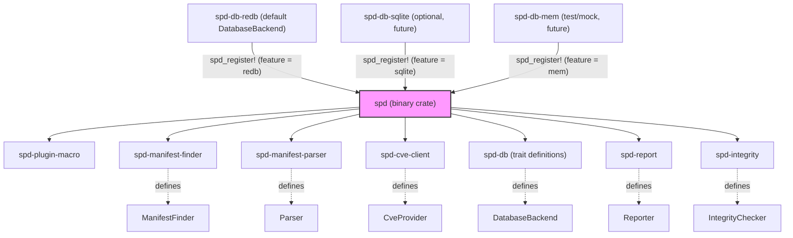
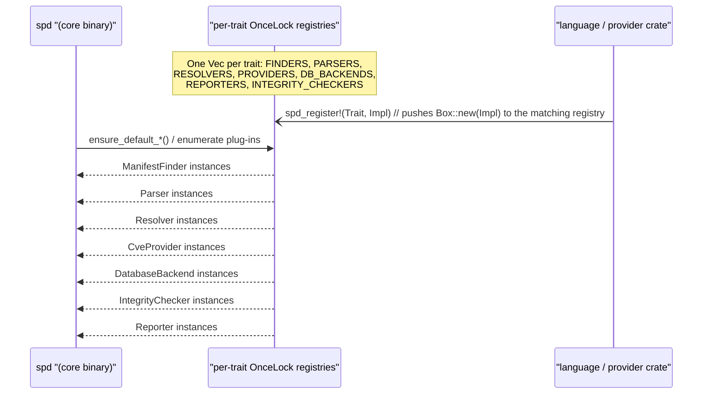

<!--
SPDX-FileCopyrightText: 2026 Travis Post <post.travis+git@gmail.com>

SPDX-License-Identifier: GPL-3.0-or-later
-->

# Contributing to super-duper

Thank you for your interest in contributing. This document gives a short
overview of the crate layout and extension points.

## Crate architecture

The workspace is split into:

- **spd** -- Binary; parses CLI, loads config, dispatches subcommands, runs the
  scan pipeline.
- **spd-db** -- Trait definitions: `Package`, `CveRecord`, `DatabaseBackend`,
  etc.
- **spd-db-redb** -- Default RedB implementation for CVE cache and
  false-positive (ignore) DB.
- **spd-manifest-finder** -- Trait `ManifestFinder`; no default implementation.
- **spd-manifest-parser** -- Traits `Parser` and `Resolver`; defines
  `DependencyGraph`; no default implementations.
- **spd-python** -- Python language plugin: implements `ManifestFinder`,
  `Parser`, and `Resolver` for Python (requirements.txt, pyproject.toml, etc.).
- **spd-cve-client** -- Trait `CveProvider`; default OSV.dev client.
- **spd-report** -- Trait `Reporter`; plain, JSON, HTML, SARIF reporters.
- **spd-integrity** -- Trait `IntegrityChecker`; default delegates to backend
  `verify_integrity`.
- **spd-plugin-macro** -- `spd_register!` macro for registering default plugins
  in the binary.

The binary uses **per-trait registries** (e.g. `FINDERS`, `PARSERS`,
`RESOLVERS`, `PROVIDERS`, `DB_BACKENDS`, `REPORTERS`, `INTEGRITY_CHECKERS`) and
calls `ensure_default_*` at startup to push default implementations. Language
support (e.g. `spd-python`) and optional backends (e.g. SQLite) are gated
behind Cargo features; see **Feature gating** below.

See [execution-flow.mmd](architecture/execution-flow.mmd) for the full scan
pipeline.



## Quick setup

**Required (install before `make check`)**

| Dependency       | Purpose                                    | Install                       |
| ---------------- | ------------------------------------------ | ----------------------------- |
| Rust, Cargo      | Build and test                             | [rustup](https://rustup.rs/)  |
| Python 3 (≥3.11) | Scripts, linters, tests                    | OS package manager            |
| ShellCheck       | Shell script linting                       | OS package manager            |
| GNU Make (4.0+)  | Build orchestration                        | OS package manager            |
| Git              | Contributing, hooks, fuzz change detection | OS package manager            |

**Recommended**

| Dependency | Purpose                                | Install                                             |
| ---------- | -------------------------------------- | --------------------------------------------------- |
| AFL++      | Fuzzing (`make fuzz`, `make coverage`) | [AFL++](https://github.com/AFLplusplus/AFLplusplus) |

After installing dependencies and cloning, run:

```sh
make setup
make check
```

Run `make` or `make help` for a full list of targets. `make setup` bootstraps
Python venvs; REUSE is auto-installed when `check-headers` runs. Optional:
`make setup-hooks` for git pre-commit. For fuzz: AFL++ must be installed;
cargo-afl is auto-installed. For coverage: rustup, cargo-llvm-cov, and nightly
are auto-installed; AFL++ required only when `make coverage` runs (since it
runs fuzz first).

### Quick reference

| Workflow              | Target                |
|-----------------------|-----------------------|
| List all targets      | `make` / `make help`  |
| Bootstrap environment | `make setup`          |
| Full CI check         | `make check`          |
| Quick build           | `make debug`          |
| Run tests             | `make unit-tests`     |
| Coverage (with fuzz)  | `make coverage`       |
| Coverage (skip fuzz)  | `make coverage-quick` |
| Fuzz smoke test       | `make fuzz`           |
| Fuzz changed only     | `make fuzz-changed`   |
| Fuzz extended         | `make fuzz-extended`  |

## Adding a new language plugin

To add support for a new language (e.g., Java), you implement three traits
(`ManifestFinder`, `Parser`, `Resolver`), register them via a macro, and gate
the crate behind a Cargo feature. Formal trait contracts (method signatures,
error types) are in [architecture/PRD.md](architecture/PRD.md) MOD-002 and
FR-020. The diagrams below illustrate the model.

**Registration flow** -- Plugins register at compile time; the binary discovers
them at startup:



**Data pipeline** -- Your `ManifestFinder`, `Parser`, and `Resolver`
implementations participate in this data pipeline. See
[execution-flow.mmd](architecture/execution-flow.mmd) for where this pipeline
fits in the full scan.


1. Create a new crate (e.g. `spd-java`) that implements:
   - `ManifestFinder` -- discover manifest files (e.g. `pom.xml`).
   - `Parser` -- parse manifest into `DependencyGraph`.
   - `Resolver` -- resolve to `Vec<Package>` (e.g. using lock file or package
     manager).
2. Gate the crate behind a Cargo feature in the `spd` binary: add your crate
   (e.g. `spd-java`) as an optional dependency and define a feature (e.g.
   `java`) that enables it. When the feature is enabled, your crate is compiled
   and its `spd_register!` calls run (see Registration flow above). For feature
   mechanics and examples, see **Feature gating** below.
3. In the binary’s startup path, when the feature is enabled, register your
   implementations via `spd_register!` (or push to the registry directly).
4. **Add a fuzz target** for each manifest or lock format your parser supports
   (NFR-020, SEC-017). Parsers accept untrusted manifest files; fuzzing ensures
   no crash on malformed input (SEC-017). Create `tests/fuzz/fuzz_targets/<format>.rs` (e.g.
   `fuzz_pyproject_toml.rs`) and add seed corpus under
   `tests/fuzz/corpus/<format>/`. Update `scripts/fuzz-targets.env` (add one
   mapping line: `format=path/to/source.rs`), `scripts/fuzz.sh`, and
   `tests/fuzz/Cargo.toml` to include the new target.

See [architecture/PRD.md](architecture/PRD.md) MOD-002 and FR-020 for the
formal trait contracts.

### Adding a new CVE provider

To add a new CVE provider (e.g. NVD, GitHub Advisory), implement the
`CveProvider` trait in `spd-cve-client` and register it. **Important:** map
retryable errors (connection timeout, connection refused, rate limiting 429,
server errors 5xx) to `ProviderError::Network` or `ProviderError::Transient`
so that `RetryingCveProvider` automatically applies exponential backoff
(NFR-005, SEC-007). Use `Transient { retry_after_secs: Some(n), ... }` when
the upstream API returns a Retry-After value (e.g. HTTP 429 with header).

## Feature gating (MOD-003)

The `spd` binary supports optional capabilities via Cargo features:

- **default** = `["redb", "python"]` -- full build with Python support and RedB backend.
- **redb** -- RedB database backend for CVE cache and false-positive DB.
- **python** -- Python language plugin (`spd-python` crate).
- **sqlite**, **mem** -- placeholders for future backends.

Build a **minimal binary** (no Python, no RedB) with:

```sh
cargo build --no-default-features
```

Build with only Java (when `spd-java` exists) and no Python:

```sh
cargo build --no-default-features --features java
```

A minimal build omits language plugins and the RedB backend; `spd list` will
output nothing, and `spd scan` will fail with "No ManifestFinder plug‑in
registered". See [architecture/PRD.md](architecture/PRD.md) MOD-003.

## Adding dependencies

Before adding a dependency, consider whether the functionality can be
implemented in-house. If the logic is simple (e.g., string splitting, basic
parsing, small helpers), implement it in the relevant crate. If a dependency
is necessary, document in the PR: (a) why in-house is not practical, (b)
GPL-3.0 compatibility, (c) impact on `cargo tree` / build time. See
[architecture/PRD.md](architecture/PRD.md) NFR-019, MOD-004, and the Minimal
Dependencies design principle.

## Copyright and licensing (REUSE)

The project uses the [REUSE](https://reuse.software/) toolchain for SPDX
copyright and license headers. Default license and copyright are defined in
`pyproject.toml` under `[tool.spd-headers]`.

- **Check headers:** `make check-headers` (runs `check-header-duplicates` and
  `reuse lint`)
- **Add/update headers:** `make headers` (runs `scripts/update_headers.py`)
- **Install Git hooks:** Run `make setup-hooks` or `./scripts/install-hooks.sh`
  to add a pre-commit hook that inserts REUSE headers into newly created files,
  using the Git author as the copyright holder. Requires `git config user.name`
  and `user.email` to be set.
- **Manual SPDX headers:** If you add SPDX headers by hand (e.g. when creating
  a new file before running `make headers`), include a trailing blank line after
  the header block. Use an actual empty line, not a commented blank line. This
  ensures REUSE automation does not overwrite or merge incorrectly with
  existing header content when `reuse annotate` or `make headers` runs later.

REUSE is auto-installed when missing: `scripts/ensure-reuse.sh` tries (in
order) `reuse` in PATH, `.venv/bin/reuse` if present, then creates
`.venv-reuse` and installs via pip. Your `.venv` is never created or modified.
You can also install manually: `pipx install reuse` or
`python3 -m venv .venv && .venv/bin/pip install reuse`.

The `update_headers.py` script derives copyright from git history and applies
the *nontrivial change* threshold (~15 lines per author per file). See
[docs/NONTRIVIAL-CHANGE.md](docs/NONTRIVIAL-CHANGE.md) for the definition.

**.mailmap:** Contributors who use multiple email addresses should add a
`.mailmap` entry at the repository root to map alternate identities to a
canonical form. Format: `Canonical Name <canonical@email.com> Alternate Name <alt@email.com>`.
The `make headers` script uses `git log --use-mailmap`, so `.mailmap` affects
which copyright lines are generated. `make check-header-duplicates` verifies
no file lists the same copyright holder twice (per `.mailmap` canonicalization).

## Code style and checks

- Run `make check` before submitting to verify headers, build, tests, and
  linters (including `lint-python` and `lint-shell`).
- Follow the [Rust Style Guide](https://doc.rust-lang.org/beta/style-guide/index.html).
- The codebase uses `#![deny(unsafe_code)]`.
- Run `cargo fmt` and `cargo clippy` before submitting.
- Python scripts in `scripts/` follow PEP 8, use line length 79, and pass
  `make lint-python` (black, pylint, mypy, bandit). The Makefile auto-creates
  `.venv-lint` and installs the linters if they are not found.
- Shell scripts in `scripts/` follow
  [Google's Shell Style Guide](https://google.github.io/styleguide/shellguide.html)
  (PRD NFR-022). Run `make lint-shell` (ShellCheck) before submitting.
  Install ShellCheck via your package manager (e.g. `apt install shellcheck`).
  Key rules: use `#!/usr/bin/env bash` or `#!/bin/bash`; 2-space indentation;
  max 80-character lines; prefer `$(command)` over backticks and `[[ ]]` over
  `[ ]`; quote variables (`"${var}"`); use `local` in functions; send error
  messages to stderr (`>&2`). The style guide is authoritative; this is a
  concise summary.
- We **encourage** a **test-driven development (TDD)** approach (see below).
  Add unit tests in the crate that owns the logic; integration tests where
  appropriate. We may ask for tests to be added or updated before merging.
- Keep line lengths to less than 100 characters. Give a best effort at keeping
  line lengths below 80 characters (i.e., 79 characters or less) so that users
  with 80-character terminals can view the entire line, even when viewing
  patch files/diffs. Some lines can extend past this guideline when it improves
  readability (e.g., long URLs that can't be reasonably broken apart). This
  applies to source code and other text such as Markdown files, but does not
  apply to auto-generated files.
- In code comments and documentation, do not use em dashes or en dashes.
  Use `--` instead of em dashes, and `-` instead of en dashes.

### CLI output (stdout)

In `spd/src/main.rs`, use the `write_stdout()` helper for all user-facing
stdout (e.g. anything that would otherwise be `println!`). Do not use
`println!` for that. This ensures every command exits with code 0 when stdout
is a broken pipe (e.g. `spd db show | less` then `q`), instead of panicking.
Stderr can stay as `eprintln!` or `log::error!`.

## Running tests and coverage

- **Run tests:** `make unit-tests` runs both `cargo test` and
  `make test-scripts`. To test only Rust: `cargo test`. To test a single crate
  (see MOD-005): `cargo test -p <crate>` (e.g. `cargo test -p spd-cve-client`).
- **Generate coverage (cargo-llvm-cov, XML for CI):** Use **cargo-llvm-cov**
  with the **nightly** toolchain so all workspace crates appear in the report.
  1. Install cargo-llvm-cov: `cargo install cargo-llvm-cov --locked`
  2. Install the nightly toolchain and LLVM tools:
     `rustup toolchain install nightly` and
     `rustup component add llvm-tools --toolchain nightly`
  3. Run coverage from the repo root:
     - **Full run (CI):** `make coverage` -- runs fuzz first (cargo-llvm-cov +
       AFL improves metrics; NFR-012, NFR-020), then coverage. Slower (~90s+
       for fuzz).
     - **Quick run (dev):** `make coverage-quick` -- skips fuzz, runs coverage
       only. Use when you have not changed fuzz-relevant code.
     - Direct script: `./scripts/coverage.sh` (same as `make coverage-quick`).
     - The script uses the
       [external tests](https://docs.rs/crate/cargo-llvm-cov/latest#get-coverage-of-external-tests)
       workflow: `cargo llvm-cov show-env`, then `cargo build` and direct
       binary invocation, so the xtask binary is covered without depending on
       `cargo llvm-cov run`.
     - Reports: `reports/rust/html/index.html` (Rust HTML),
       `reports/cobertura.xml` (Rust Cobertura), `reports/python/index.html`
       (Python HTML), `reports/cobertura-python.xml` (Python Cobertura).
     - Thresholds (NFR-012, NFR-017): Rust >= 85% line, >= 80% function, >= 85%
       region; scripts >= 85% line. The coverage run **exits 1** when
       below these thresholds.
- **CI:** The Cobertura XML files (`reports/cobertura.xml`,
  `reports/cobertura-python.xml`) are consumed by common CI systems; see
  [taiki-e/cargo-llvm-cov](https://github.com/taiki-e/cargo-llvm-cov) or
  [taiki-e/install-action](https://github.com/taiki-e/install-action) for
  GitHub Actions.

**[!NOTE]** Branch coverage is currently **disabled** in the default coverage
run (line, function, and region coverage only). Enabling `--branch` can
trigger an LLVM llvm-cov crash (SIGSEGV) when the report includes the
proc-macro crate. Until that toolchain bug is resolved, coverage reports show
line, function, and region metrics; branch threshold (70%) remains the target
when branch coverage is re-enabled.

### Script testing (NFR-021)

- **Run script tests:** `make test-scripts` runs `pytest tests/scripts/ -v`.
- **Prerequisites:** The Makefile auto-creates `.venv-test` and installs pytest
  and pytest-cov. Run `make setup` first, or `make test-scripts` will bootstrap
  it on demand.
- **Placement:** Script tests live in `tests/scripts/`; the `scripts/` package
  is imported via conftest path setup.
- **Coverage:** `make coverage` or `make coverage-quick` runs script tests
  with pytest-cov
  (`--cov=scripts --cov-fail-under=85`). Reports: `reports/python/index.html`,
  `reports/cobertura-python.xml`.

### Fuzz testing (NFR-020)

- **Three tiers:**
  - **Smoke (default):** `make fuzz` or `./scripts/fuzz.sh` runs all targets
    (~30 s each). Use for on-demand verification.
  - **Changed code only:** `make fuzz-changed` or `./scripts/fuzz.sh --changed`
    runs only targets whose mapped files changed. **Skipped** when
    none of the mapped files have changed (exit 0).
  - **Extended:** `make fuzz-extended` or `./scripts/fuzz.sh --extended` runs
    all targets with 30 min timeout each. Use for nightly or deep verification.
- **Mapping:** `scripts/fuzz-targets.env` maps each target to source paths.
  Add one mapping entry when adding a new fuzz target.
- **FUZZ_TIMEOUT:** Overrides per-target timeout (seconds). When unset: 30
  (smoke) or 1800 (extended).
- **Exit codes (FR-009):** The script exits 0 when no crashes (or when skipped);
  exits 1 when crashes are found. Crash paths written to
  `reports/fuzz-crashes.txt`.
- **Prerequisites:** [cargo-afl](https://github.com/rust-fuzz/afl.rs) and
  [AFL++](https://github.com/AFLplusplus/AFLplusplus).
- **Targets:** `fuzz_config_toml`, `fuzz_requirements_txt`,
  `fuzz_parse_config_set_arg`. Seed corpus in `tests/fuzz/corpus/`.
- **Coverage:** `./scripts/fuzz.sh --coverage` integrates with cargo-llvm-cov
  (see
  [cargo-llvm-cov AFL docs](https://github.com/taiki-e/cargo-llvm-cov#get-coverage-of-afl-fuzzers)).

## Test-driven development (TDD)

We use **test-driven development**: write tests that define the desired
behavior first, then implement code until those tests pass. TDD keeps
requirements explicit, avoids over-implementation, and gives a clear target for
each change. Tests belong in the crate that owns the logic (unit tests) or in
the appropriate integration test layout.

**Placement (Rust convention):** Unit tests live in the same file as the code
under test (or same crate) in a `#[cfg(test)] mod tests` block; integration
tests live in a top-level `tests/` directory or, for the binary, in tests that
run the built executable. **Documenting expected behavior:** Each test should
make the behavior it verifies clear--e.g. descriptive test names, a short `///`
doc comment tying the test to a requirement (e.g. FR-006, SEC-006), or
assertions that make the expected outcome obvious.

### TDD workflow

1. **Write tests** -- Define tests from expected inputs and outputs (or
   behavior) based on PRD requirements. When using an AI agent, be explicit
   that you are doing TDD so that agents do not create mock implementations for
   functionality that does not exist yet.
2. **Run tests and confirm they fail** -- Run the test suite and ensure the new
   tests fail for the right reason. Do not write implementation code at this
   stage.
3. **Commit the tests** -- Once the tests are satisfactory, commit them.
4. **Implement to pass** -- Write the minimal code that makes the tests pass.
   Do not change the tests to match the implementation; iterate on the code
   until all tests pass.
5. **Code coverage** -- Ensure code coverage meets or exceeds minimum
   thresholds. Add mocking if necessary, and iterate until coverage targets are
   satisfied.
6. **Commit the implementation** -- When all tests pass and you are satisfied,
   commit the implementation.

### Instructions for AI users

AI agents that read [AGENTS.md](AGENTS.md) are expected to follow TDD
automatically when adding or changing behavior. If you use an AI assistant to
contribute, you may instruct your agent explicitly using the steps below, or
rely on it reading AGENTS.md. If your agent is not following TDD, ensure it has
read AGENTS.md or include one of the prompts below in your request.

**Explicit prompts:**

- **Step 1:** "Write tests based on expected input/output pairs. We are doing
  TDD--do not create mock implementations for functionality that does not yet
  exist."
- **Step 2:** "Run the tests and confirm they fail. Do not write implementation
  code at this stage."
- **Step 3:** Commit the tests when satisfied.
- **Step 4:** "Write code that passes the tests. Do not modify the tests. Keep
  iterating until all tests pass."
- **Step 5:**: At this point, if mocking is required, implement it now and
  confirm code coverage thresholds are met.
- **Step 6:** Commit the implementation when satisfied.

## Requirements

Full requirements (functional, non-functional, security, configuration) are in
[architecture/PRD.md](architecture/PRD.md). When adding features, align with
the relevant IDs (e.g. FR-*, NFR-*, SEC-*, CFG-*).
