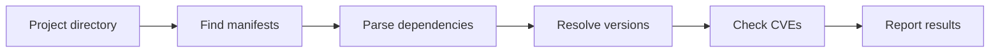

<!--
SPDX-FileCopyrightText: 2026 Travis Post <post.travis@gmail.com>

SPDX-License-Identifier: GPL-3.0-or-later
-->

# verilyze (vlz)

Fast, modular Software Composition Analysis (SCA) tool for dependency
vulnerabilities. Written in Rust.

[](https://github.com/verilyze/verilyze/actions/workflows/ci.yml)
[](https://github.com/verilyze/verilyze/actions/workflows/coverage-nightly.yml)
[](https://github.com/verilyze/verilyze/actions/workflows/coverage-nightly.yml)
[](https://github.com/verilyze/verilyze/actions/workflows/super-linter-nightly.yml)
[](https://www.bestpractices.dev/projects/12361)
[](https://scorecard.dev/viewer/?uri=github.com/verilyze/verilyze)

## Prerequisites

- **Rust and Cargo** on your PATH ([rustup](https://rustup.rs/) recommended).
- **GNU Make 4+** for the recommended build path below.
- **Network access** for the default CVE provider (OSV.dev) unless you use
  `--offline` with a warm local cache (see [docs/FAQ.md](docs/FAQ.md)).
- **HTTP/HTTPS proxy** (optional): CVE fetches honor **HTTP_PROXY** /
  **HTTPS_PROXY** / **NO_PROXY** (and lowercase forms); see
  [INSTALL.md](INSTALL.md) (OP-018).

## Quick start

From a clone of this repository:

```bash
make release
# Binary: target/release/vlz
```

Run scans with the built binary (adjust the path if you use `CARGO_TARGET_DIR`):

```bash
# Scan current directory for manifests (Python: requirements.txt, pyproject.toml;
# Rust: Cargo.toml; Go: go.mod) and check for CVEs
./target/release/vlz scan

# Scan a specific path
./target/release/vlz scan /path/to/project

# Scan a Rust project
./target/release/vlz scan /path/to/rust/crate

# Scan a Go module
./target/release/vlz scan /path/to/go/module

# JSON output
./target/release/vlz scan --format json

# SBOM output (CycloneDX 1.6, SPDX 3.0)
./target/release/vlz scan --format cyclonedx
./target/release/vlz scan -s cyclonedx:sbom.cdx.json,spdx:sbom.spdx.json

# List registered language plugins
./target/release/vlz list
```

After `make install` or `cargo install --path ...`, use `vlz` on your PATH
instead of `./target/release/vlz`. Other install and packaging options:
[INSTALL.md](INSTALL.md).

## How it works



Reports include the manifest file path(s) for each vulnerable package, so you can
see which manifest(s) introduce each CVE when scanning directories with many
nested manifests (e.g. monorepos).

**Reachability:** Structured reports include per-CVE `reachable` as `true`,
`false`, or unknown (`null`/omitted). Current releases use **Tier B** checks:
direct import/reference evidence in your project source. This is a practical
signal, not exploitability proof. If the tool cannot decide safely, it reports
unknown. For maintainer-level tier definitions (Tier A-D) and decision rules,
see [CONTRIBUTING.md](CONTRIBUTING.md).

## Installation

GitHub-hosted release assets are available for tagged releases:
- GitHub Release assets: Linux binary, `.deb`, and `.rpm`
- Release integrity files: `SHA256SUMS` plus Sigstore `.sig`/`.pem` files
- GHCR container image tags: versioned tag and `latest`

crates.io packages and external distro/community repository publication are not
included in this release scope. Typical local/source-based approaches remain:

- **Local build:** `make release`, then run `target/release/vlz` (see Quick start).
- **System install:** `make install` with optional `PREFIX` / `DESTDIR`.
- **Packages:** build `.deb`, `.rpm`, AUR artifacts, or Alpine APKs via Makefile
  targets; build a **local** OCI image with `make docker`.

Full commands, Docker usage, optional providers, and shell completion:
[INSTALL.md](INSTALL.md).

## Shell completion

Completions are installed with **`make install`**, or generate them with
`vlz generate-completions` (see [INSTALL.md](INSTALL.md#shell-completion)).

## Configuration precedence

Options are resolved in precedence order; each source overrides the ones below:

1. **CLI flags** (e.g. `--parallel 20`, `--cache-ttl-secs 86400`, `--min-score 7.0`) -- highest precedence
2. **Environment variables** `VLZ_*` (e.g. `VLZ_PARALLEL_QUERIES=20`,
   `VLZ_CACHE_TTL_SECS=86400`)
3. **User config file** (`-c/--config <path>` or default
   `$XDG_CONFIG_HOME/verilyze/verilyze.conf`)
4. **System config** (`/etc/verilyze.conf`) -- lowest precedence

**Cache TTL:** Changing **cache_ttl_secs** (via config, env, or CLI) only affects
**new** cache entries; existing entries keep their stored expiry until they
expire or are purged. See [docs/configuration.md](docs/configuration.md) and
`vlz db set-ttl` for adjusting existing entries.

See [architecture/PRD.md](architecture/PRD.md) (CFG-001 - CFG-008) and the full
key table in [docs/configuration.md](docs/configuration.md). Run
`vlz config --list` for effective values.

**Environment variables for optional CVE providers** (not stored in config):

| Variable             | Provider   | Purpose                                          |
|----------------------|------------|--------------------------------------------------|
| GITHUB_TOKEN         | GitHub     | Optional; higher rate limits (Actions sets this) |
| VLZ_GITHUB_TOKEN     | GitHub     | Override for GITHUB_TOKEN                        |
| VLZ_SONATYPE_EMAIL   | Sonatype   | Required for Sonatype OSS Index                  |
| VLZ_SONATYPE_TOKEN   | Sonatype   | Required for Sonatype OSS Index                  |

## CLI reference (summary)

**Help and manuals:** `vlz --help` prints a short usage summary from clap.
**`vlz help`** opens the full manual by running `man` on the embedded **`vlz.1`**
(when built with the default `docs` feature; otherwise it exits 2 with a hint).
**`vlz help [SUBCOMMAND]`** accepts an optional subcommand name; today it shows
the same main manual as `vlz help`. After **`make install`**, **`man vlz`**
uses the installed man page. Source: [man/vlz.1](man/vlz.1).

| Subcommand                   | Description                                                   |
|------------------------------|---------------------------------------------------------------|
| `vlz scan [PATH]`            | Scan for manifests and CVEs; optional path (default: cwd)     |
| `vlz list`                   | List registered language plugins                              |
| `vlz config --list`          | Show effective configuration                                  |
| `vlz config --example`       | Output verilyze.conf.example with effective values for this environment |
| `vlz config --set KEY=VALUE` | Set a config key (e.g. `python.regex="^requirements\\.txt$"`) |
| `vlz db list-providers`      | List CVE providers (e.g. osv, nvd, github, sonatype when built with respective features) |
| `vlz db stats`               | Cache statistics                                              |
| `vlz db show [--format FORMAT] [--full]` | Display cache entries (key, TTL, added-at, CVE summary or full payload) |
| `vlz db set-ttl SECS [--entry KEY] [--all] [--pattern PATTERN] [--entries KEYS]` | Update TTL for existing cache entries |
| `vlz db verify`              | Verify database integrity (SHA-256)                           |
| `vlz db migrate`             | Run migrations                                                |
| `vlz fp mark CVE-ID [--comment ...] [--project-id ID]` | Mark CVE as false positive (optional project scope) |
| `vlz fp unmark CVE-ID`       | Remove false-positive marking                                 |
| `vlz generate-completions SHELL` | Generate shell completion script (bash, zsh, fish)      |
| `vlz help [SUBCOMMAND]`      | Show full manual (`vlz.1`) via `man`; subcommand optional   |
| `vlz --version`              | Print version                                                 |

**Scan options (examples):** `--format plain|json|sarif|cyclonedx|spdx`,
`--summary-file html:path,cyclonedx:sbom.json,spdx:sbom.spdx.json`,
`--provider osv|nvd|github|sonatype`, `--parallel N`, `--project-id ID`,
`--cache-ttl-secs SECS`, `--offline`, `--benchmark`, `--min-score`, `--min-count`,
`--exit-code-on-cve`, `--fp-exit-code`, `--cache-db`, `--ignore-db`,
`--reachability-mode off|tier-b|best-available`.

### Project-scoped false-positives

For project-scoped false-positives: (1) run `vlz fp mark CVE-ID --project-id X` to
add a scoped FP; (2) run `vlz scan --project-id X` when scanning that project. Both
commands must use the same project_id for the FP to apply. When scanning without
`--project-id`, only global FPs (marked without `--project-id`) apply.

## Exit codes

Exit 0 means the analysis completed successfully and the result is known. Any
failure (config, network, parsing, etc.) returns a non-zero code to prevent
false-negatives in CI.

| Code | Meaning                                                                         |
|------|---------------------------------------------------------------------------------|
| 0    | Success: analysis completed; no CVEs (or only false-positives per fp-exit-code) |
| 1    | Panic / internal error                                                          |
| 2    | Misconfiguration (unknown key, invalid value, etc.)                             |
| 3    | Missing required package manager                                                |
| 4    | CVE lookup needed but `--offline`                                               |
| 5    | CVE provider fetch failed (network, API error, auth, etc.)                      |
| 86   | One or more CVEs meet threshold (overridable via `--exit-code-on-cve`)          |

## Bug reports and feedback

Report bugs, regressions, or feature ideas via
**[GitHub Issues](https://github.com/verilyze/verilyze/issues)** so they stay
searchable and linkable. For **security vulnerabilities**, use the process in
[SECURITY.md](SECURITY.md) (private report), not a public issue.

## For contributors

Run `make setup` first. It checks required system tools (`python3`, `cargo`,
`shellcheck`) and bootstraps non-system developer tools (`cargo-deny`,
`cargo-about`, `cargo-llvm-cov`, `cargo-afl`, plus Python lint/test venvs).
If the first compile warns about a missing linker, install `gcc` + `ld.bfd`
(typically via `binutils`) and retry. Defaults are overridable per invocation,
for example `CC=clang RUSTFLAGS="-Clink-arg=-fuse-ld=lld" make debug`.
On Linux, if coverage link behavior needs explicit GNU `ld.bfd`, use
`VLZ_COVERAGE_USE_BFD=1` as documented in
[CONTRIBUTING.md](CONTRIBUTING.md#running-tests-and-coverage).
Then run `make check` for the standard pre-commit gate. For fuzz testing
(smoke, changed-code-only, or extended), see [CONTRIBUTING.md](CONTRIBUTING.md)
(Fuzz testing, NFR-020).

## Documentation

- **Installation and packaging:** [INSTALL.md](INSTALL.md)
- **Configuration reference:** [docs/configuration.md](docs/configuration.md)
- **Requirements and architecture:** [architecture/PRD.md](architecture/PRD.md)
- **Execution flow:** [architecture/execution-flow.mmd](architecture/execution-flow.mmd)
- **FAQ and troubleshooting:** [docs/FAQ.md](docs/FAQ.md)
- **Contributing:** [CONTRIBUTING.md](CONTRIBUTING.md)
- **Guidance for AI agents:** [AGENTS.md](AGENTS.md)
- **Security:** [SECURITY.md](SECURITY.md)
- **Changelog:** [CHANGELOG.md](CHANGELOG.md)
- **OpenSSF Best Practices:** [bestpractices.dev project entry](https://www.bestpractices.dev/en/projects/12361)
