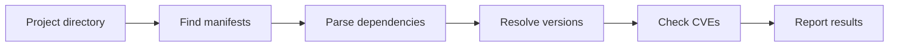

<!--
SPDX-FileCopyrightText: 2026 Travis Post <post.travis@gmail.com>

SPDX-License-Identifier: GPL-3.0-or-later
-->

# verilyze (vlz)

Fast, modular Software Composition Analysis (SCA) tool for dependency
vulnerabilities. Written in Rust.

**License:** GPL-3.0-or-later. See
[LICENSES/GPL-3.0-or-later.txt](LICENSES/GPL-3.0-or-later.txt) for the full
text.

## Installation

```bash
cargo install vlz
```

- **Privileged:** binary goes to `/usr/local/bin/` (or equivalent).
- **Non-privileged:** binary goes to `$HOME/.cargo/bin/`.

The default build includes the OSV CVE provider. The NVD provider is opt-in
(reasons: NVD rate limits, binary size; see [docs/FAQ.md](docs/FAQ.md)). To
include NVD: `cargo install vlz --features nvd`, then `vlz scan --provider nvd`.

## Shell completion

Shell completions for Bash, Zsh, and Fish are installed by default when using
package managers (deb, rpm, apk, pkg, ebuild). For `cargo install` or manual
builds, generate and source them:

**Bash:**
```bash
vlz generate-completions bash | sudo tee /usr/share/bash-completion/completions/vlz > /dev/null
# or for current user:
vlz generate-completions bash > ~/.local/share/bash-completion/completions/vlz
```

**Zsh:**
```bash
vlz generate-completions zsh > "${fpath[1]}/_vlz"
# or: vlz generate-completions zsh > ~/.zsh/site-functions/_vlz
```

**Fish:**
```bash
vlz generate-completions fish > ~/.config/fish/completions/vlz.fish
```

## Running with Docker

Build the image from the repo root:

```bash
make docker
# or: docker build -f packaging/docker/Dockerfile -t verilyze .
```

Scan a project by mounting it into the container:

```bash
docker run --rm -v "$(pwd)":/scan verilyze scan /scan
```

On SELinux systems (Fedora, RHEL, CentOS), add `:z` to the volume so the
container can read the mounted files:

```bash
docker run --rm -v "$(pwd)":/scan:z verilyze scan /scan
```

For persistent CVE cache between runs, mount the host cache directory and pass
`--cache-db` (required because the container runs as root and would otherwise
use the privileged path `/var/cache/verilyze/`). Run as your user so cache
files are owned by you, not root:

```bash
# Create cache directory so it is owned by you (not root)
mkdir -p ~/.cache/verilyze

# Run as your user so cache files are owned by you, not root
docker run --rm --user "$(id -u):$(id -g)" \
  -v "$(pwd)":/scan:z -v "$HOME/.cache/verilyze":/cache:z \
  verilyze scan /scan --cache-db /cache/vlz-cache.redb
```

Without `--user`, the container runs as root and cache files in
`~/.cache/verilyze` will be owned by root on the host.

## Quick start

```bash
# Scan current directory for manifests (Python: requirements.txt, pyproject.toml;
# Rust: Cargo.toml) and check for CVEs
vlz scan

# Scan a specific path
vlz scan /path/to/project

# Scan a Rust project
vlz scan /path/to/rust/crate

# JSON output
vlz scan --format json

# SBOM output (CycloneDX 1.6, SPDX 3.0)
vlz scan --format cyclonedx
vlz scan -s cyclonedx:sbom.cdx.json,spdx:sbom.spdx.json

# List registered language plugins
vlz list
```

## How it works



## Configuration precedence

Options are resolved in precedence order; each source overrides the ones below:

1. **CLI flags** (e.g. `--parallel 20`, `--cache-ttl-secs 86400`, `--min-score 7.0`) -- highest precedence
2. **Environment variables** `VLZ_*` (e.g. `VLZ_PARALLEL_QUERIES=20`,
   `VLZ_CACHE_TTL_SECS=86400`)
3. **User config file** (`-c/--config <path>` or default
   `$XDG_CONFIG_HOME/verilyze/verilyze.conf`)
4. **System config** (`/etc/verilyze.conf`) -- lowest precedence

See [architecture/PRD.md](architecture/PRD.md) (CFG-001 - CFG-008) for full
details.

| Key              | Default         | Env var                | CLI flag         |
|------------------|-----------------|------------------------|------------------|
| cache_ttl_secs   | 432000 (5 days) | VLZ_CACHE_TTL_SECS     | --cache-ttl-secs |
| parallel_queries | 10              | VLZ_PARALLEL_QUERIES   | --parallel       |
| min_score        | 0               | VLZ_MIN_SCORE          | --min-score      |
| min_count        | 0               | VLZ_MIN_COUNT          | --min-count      |
| backoff_base_ms  | 100             | VLZ_BACKOFF_BASE_MS    | --backoff-base   |
| backoff_max_ms   | 30000           | VLZ_BACKOFF_MAX_MS     | --backoff-max    |
| max_retries      | 5               | VLZ_MAX_RETRIES        | --max-retries    |

**Environment variables for optional CVE providers** (not stored in config):

| Variable             | Provider   | Purpose                                          |
|----------------------|------------|--------------------------------------------------|
| GITHUB_TOKEN         | GitHub     | Optional; higher rate limits (Actions sets this) |
| VLZ_GITHUB_TOKEN     | GitHub     | Override for GITHUB_TOKEN                        |
| VLZ_SONATYPE_EMAIL   | Sonatype   | Required for Sonatype OSS Index                  |
| VLZ_SONATYPE_TOKEN   | Sonatype   | Required for Sonatype OSS Index                  |

Changing **cache_ttl_secs** only affects new cache entries; existing entries
keep their stored expiry until they expire or are purged.

Run `vlz config --list` to print effective values.

## CLI reference (summary)

| Subcommand                   | Description                                                   |
|------------------------------|---------------------------------------------------------------|
| `vlz scan [PATH]`            | Scan for manifests and CVEs; optional path (default: cwd)     |
| `vlz list`                   | List registered language plugins                              |
| `vlz config --list`          | Show effective configuration                                  |
| `vlz config --example`       | Output verilyze.conf.example with effective values for this environment |
| `vlz config --set KEY=VALUE` | Set a config key (e.g. `python.regex="^requirements\\.txt$"`) |
| `vlz db list-providers`      | List CVE providers (e.g. osv, nvd, github, sonatype when built with respective features) |
| `vlz db stats`               | Cache statistics                                              |
| `vlz db show [--format FORMAT] [--full]` | Display cache entries (key, TTL, added-at, CVE summary or full payload) |
| `vlz db set-ttl SECS [--entry KEY] [--all] [--pattern PATTERN] [--entries KEYS]` | Update TTL for existing cache entries |
| `vlz db verify`              | Verify database integrity (SHA-256)                           |
| `vlz db migrate`             | Run migrations                                                |
| `vlz fp mark CVE-ID [--comment ...]` | Mark CVE as false positive                            |
| `vlz fp unmark CVE-ID`       | Remove false-positive marking                                 |
| `vlz generate-completions SHELL` | Generate shell completion script (bash, zsh, fish)      |
| `vlz --version`              | Print version                                                 |

**Scan options (examples):** `--format plain|json|sarif|cyclonedx|spdx`,
`--summary-file html:path,cyclonedx:sbom.json,spdx:sbom.spdx.json`,
`--provider osv|nvd|github|sonatype`, `--parallel N`, `--cache-ttl-secs SECS`, `--offline`,
`--benchmark`, `--min-score`, `--min-count`, `--exit-code-on-cve`,
`--fp-exit-code`, `--cache-db`, `--ignore-db`.

## Exit codes

Exit 0 means the analysis completed successfully and the result is known. Any
failure (config, network, parsing, etc.) returns a non-zero code to prevent
false-negatives in CI.

| Code | Meaning                                                                         |
|------|---------------------------------------------------------------------------------|
| 0    | Success: analysis completed; no CVEs (or only false-positives per fp-exit-code) |
| 1    | Panic / internal error                                                          |
| 2    | Misconfiguration (unknown key, invalid value, etc.)                             |
| 3    | Missing required package manager                                                |
| 4    | CVE lookup needed but `--offline`                                               |
| 5    | CVE provider fetch failed (network, API error, auth, etc.)                      |
| 86   | One or more CVEs meet threshold (overridable via `--exit-code-on-cve`)          |

## Testing

Run `make check` for the standard pre-commit gate. For fuzz testing (smoke,
changed-code-only, or extended), see [CONTRIBUTING.md](CONTRIBUTING.md)
(Fuzz testing § NFR-020).

## Documentation

- **Configuration reference:** [docs/configuration.md](docs/configuration.md)
- **Requirements and architecture:** [architecture/PRD.md](architecture/PRD.md)
- **Execution flow:** [architecture/execution-flow.mmd](architecture/execution-flow.mmd)
- **FAQ and troubleshooting:** [docs/FAQ.md](docs/FAQ.md)
- **Contributing:** [CONTRIBUTING.md](CONTRIBUTING.md)
- **Security:** [SECURITY.md](SECURITY.md)
