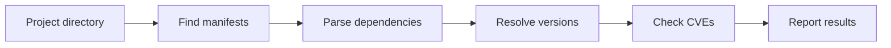

<!--
SPDX-FileCopyrightText: 2026 Travis Post <post.travis@gmail.com>

SPDX-License-Identifier: GPL-3.0-or-later
-->

# verilyze (vlz)

Lock-first Software Composition Analysis for dependency vulnerabilities.
A fast Rust CLI you run in CI and locally -- no SaaS desk required.

[](https://github.com/verilyze/verilyze/actions/workflows/ci.yml)
[](https://github.com/verilyze/verilyze/actions/workflows/coverage-nightly.yml)
[](https://github.com/verilyze/verilyze/actions/workflows/coverage-nightly.yml)
[](https://github.com/verilyze/verilyze/actions/workflows/super-linter-nightly.yml)
[](https://github.com/verilyze/verilyze/actions/workflows/verilyze-nightly.yml)
[](https://www.bestpractices.dev/projects/12361)
[](https://scorecard.dev/viewer/?uri=github.com/verilyze/verilyze)

## Why verilyze

Most SCA tools either bury you in noisy version matches or lock you into a
hosted platform. verilyze is a small, scriptable CLI that fails closed when
it cannot finish the analysis, prefers lock files over executing project
code, and gives you SBOM and VEX without a SaaS subscription. You keep
control of CI exit codes, offline caches, and which providers you trust.

## Features

- **Eight ecosystems plus SBOM input** -- Python, Rust, Go, JavaScript/TypeScript,
  Java/Kotlin, Ruby, PHP, .NET, and CycloneDX/SPDX inventories
- **Lock-first, fail-closed** -- missing locks for most languages exit 4 by
  default instead of silently under-scanning
- **Reachability and exploitability signals** -- heuristic reachability tiers
  plus CISA KEV and FIRST EPSS; findings stay listed (not auto-suppressed)
- **SBOM and VEX** -- emit CycloneDX 1.6, SPDX 3.0, and OpenVEX; consume VEX
  suppressions and scan from an existing SBOM
- **Local remediation and editor support** -- `vlz fix` (dry-run or apply) and
  `vlz lsp` for diagnostics
- **Airgap-ready cache** -- `vlz preload` and `vlz db import` for offline CI
- **OSV by default** -- optional NVD, GitHub Advisory, and Sonatype providers
  when you build or enable them

## Install

**Release binary** (no Rust toolchain required) -- download a platform archive
from [GitHub Releases](https://github.com/verilyze/verilyze/releases), verify
checksums / Cosign as documented in [INSTALL.md](INSTALL.md), and put `vlz` on
your `PATH`.

**Cargo:**

```bash
cargo install vlz --locked
```

Source builds (`make release`), packages (`.deb` / `.rpm`), Docker, shell
completion, and optional providers: [INSTALL.md](INSTALL.md). Archive-only
steps: [docs/install-archive.md](docs/install-archive.md).

Default scans need network access to OSV.dev unless you use `--offline` with
a warm cache (see [docs/FAQ.md](docs/FAQ.md)).

## Quick start

Prefer a lock file next to your manifests. Without a lock, Python,
JavaScript, Java, Ruby, PHP, and .NET scans fail closed (exit 4) by default.
Details: [docs/capabilities.md](docs/capabilities.md) and
[docs/FAQ.md](docs/FAQ.md).

```bash
# Python (example): pyproject.toml or requirements.txt plus an adjacent
# pylock.toml / poetry.lock / uv.lock for transitive coverage
vlz scan /path/to/python-project

# Machine-readable report
vlz scan --format json /path/to/python-project

# Preview remediations without writing
vlz fix --dry-run /path/to/python-project
```

CI samples: [examples/github-action-vlz-scan.yml](examples/github-action-vlz-scan.yml),
[examples/gitlab-ci-vlz-scan.yml](examples/gitlab-ci-vlz-scan.yml), and the
composite action under `.github/actions/vlz-scan`.

## How it works


```mermaid
flowchart LR
    Dir[Project directory] --> Find[Find manifests]
    Find --> Parse[Parse dependencies]
    Parse --> Resolve[Resolve versions]
    Resolve --> CVE[Check CVEs]
    CVE --> Report[Report results]
```

Reports list which manifest(s) introduced each finding. Reachability is a
**heuristic signal** (`reachable: true`, `false`, or unknown) -- not
exploitability proof and not a suppress. Default mode is `best-available`
(Tier B import/reference checks plus Tier C advisory symbols where supported).
Use `--reachability-mode tier-b` for cheaper package-level-only scans.
Maintainer-level tier definitions: [CONTRIBUTING.md](CONTRIBUTING.md).

## Supported ecosystems

| Language | Plugin name | Typical locks |
|----------|-------------|---------------|
| Python | `python` | `pylock.toml`, `poetry.lock`, `uv.lock`, ... |
| Rust | `rust` | `Cargo.lock` |
| Go | `go` | `go.sum` |
| JavaScript / TypeScript | `javascript` | `package-lock.json`, `yarn.lock`, `pnpm-lock.yaml`, `bun.lock` |
| Java / Kotlin | `java` | `gradle.lockfile` |
| Ruby | `ruby` | `Gemfile.lock` |
| PHP | `php` | `composer.lock` |
| .NET | `dotnet` | `packages.lock.json` |
| SBOM | `sbom` | CycloneDX / SPDX JSON (`--from-sbom` or discovered names) |

Full lock and remediator coverage: [docs/capabilities.md](docs/capabilities.md).
List plugins: `vlz languages`.

## Exit codes

Exit 0 means the analysis finished with full transitive coverage (or an
explicit direct-only opt-in) and the result is known. Any incomplete analysis
returns non-zero so CI does not get a false negative.

When multiple **scan-phase** signals apply: `4 > 5 > 6 > 86 > 0` (or
`fp-exit-code` when only false positives remain). Panics are exit 1;
misconfiguration is exit 2; missing package manager is exit 3.

| Code | Meaning |
|------|---------|
| 0 | Success: analysis completed; no CVEs (or only false positives per `fp-exit-code`) |
| 1 | Panic / internal error (including `vlz db verify` failure) |
| 2 | Misconfiguration (invalid CLI, unknown provider, bad config) |
| 3 | Missing required package manager |
| 4 | Manifest parse or resolution failure (required transitive resolution not met) |
| 5 | CVE provider fetch failed (network, API error, auth, etc.) |
| 6 | CVE lookup needed but `--offline` |
| 86 | One or more CVEs meet threshold (overridable via `--exit-code`) |

Direct-only scans under `--offline`, `--benchmark`, or
`--allow-direct-only-fallback` exit **0** when no CVEs meet threshold, with
coverage warnings. Automated scenarios:
[`crates/core/vlz/tests/exit_code_matrix.rs`](crates/core/vlz/tests/exit_code_matrix.rs)
and [`tests/scripts/test_exit_codes.py`](tests/scripts/test_exit_codes.py).

## Configuration

Options resolve in this order (each overrides the ones below):

1. **CLI flags** (for example `--parallel 20`, `--min-score 7.0`)
2. **Environment variables** `VLZ_*` (for example `VLZ_PARALLEL_QUERIES=20`)
3. **User config** (`-c/--config` or `$XDG_CONFIG_HOME/verilyze/verilyze.conf`)
4. **System config** (`/etc/verilyze.conf`)

Full key table: [docs/configuration.md](docs/configuration.md). Effective
values: `vlz config --list`.

## CLI summary

`vlz --help` prints short usage. `vlz help` opens the embedded man page
([man/vlz.1](man/vlz.1)). After `make install`, use `man vlz`.

| Subcommand | Description |
|------------|-------------|
| `vlz scan [PATH]` | Scan for manifests and CVEs (default path: cwd) |
| `vlz languages` | List supported manifest languages |
| `vlz config` | Show or set configuration |
| `vlz db ...` | Cache stats, import, verify, migrate, providers |
| `vlz preload [path]` | Warm the CVE cache without a full report |
| `vlz fp mark` / `unmark` | False-positive triage |
| `vlz fix [PATH]` | Remediate (use `--dry-run` to preview) |
| `vlz lsp` | Language Server diagnostics |
| `vlz generate-completions SHELL` | Shell completion script |
| `vlz help [SUBCOMMAND]` | Full manual via `man` |
| `vlz --version` | Print version |

## Dig deeper

- **FAQ:** [docs/FAQ.md](docs/FAQ.md)
- **Configuration:** [docs/configuration.md](docs/configuration.md)
- **Ecosystem capabilities:** [docs/capabilities.md](docs/capabilities.md)
- **Roadmap:** [docs/ROADMAP.md](docs/ROADMAP.md)
- **Docs index:** [docs/README.md](docs/README.md)
- **Requirements:** [architecture/PRD.md](architecture/PRD.md)
- **JSON report schema:** [schemas/v1/report.json](schemas/v1/report.json)
- **CI examples:** [examples/](examples/)
- **Security:** [SECURITY.md](SECURITY.md) (private vulnerability reports)
- **Compliance:** [COMPLIANCE.md](COMPLIANCE.md)
- **Changelog:** [CHANGELOG.md](CHANGELOG.md)
- **API reference:** `cargo doc --open` (NFR-011)
- **Bugs and ideas:** [GitHub Issues](https://github.com/verilyze/verilyze/issues)

## Contributing

Run `make setup`, then `make check` before opening a PR. Architecture,
plugins, tests, and fuzzing: [CONTRIBUTING.md](CONTRIBUTING.md). Agent
guidance: [AGENTS.md](AGENTS.md).

## License

GPL-3.0-or-later. See [LICENSE](LICENSE), [LICENSES/](LICENSES/), and
[docs/LICENSING.md](docs/LICENSING.md).
