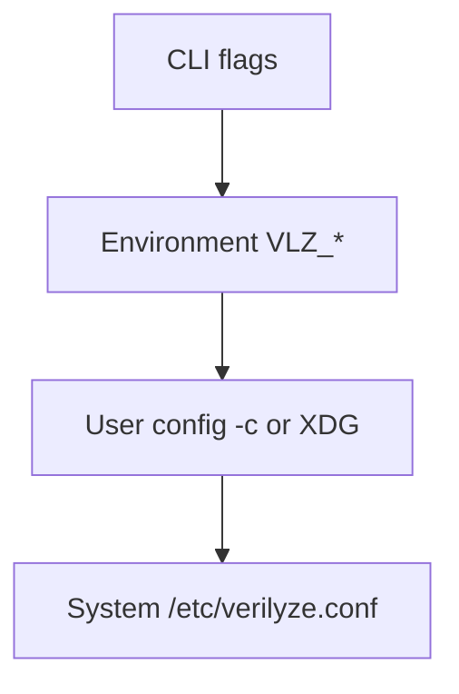

<!--
SPDX-FileCopyrightText: 2026 Travis Post <post.travis@gmail.com>

SPDX-License-Identifier: GPL-3.0-or-later
-->

# verilyze Configuration Reference (DOC-003)

This document describes every configuration key, its default value, accepted
types, corresponding environment variable, and CLI flag. See also
[verilyze.conf.example](../verilyze.conf.example) for a commented example
file, and `man verilyze.conf` for the man page. Run `vlz config --example` to
output a personalized example with effective values for your environment.

## Configuration precedence

Options are resolved in precedence order; each source overrides the ones below:



1. **CLI flags** (e.g. `--parallel 20`, `--cache-ttl-secs 86400`) -- highest
2. **Environment variables** `VLZ_*` (e.g. `VLZ_PARALLEL_QUERIES=20`)
3. **User config** (`-c/--config <path>` or `$XDG_CONFIG_HOME/verilyze/verilyze.conf`)
4. **System config** (`/etc/verilyze.conf`) -- lowest

## Scalar options

| Key | Type | Default | Env var | CLI flag |
|-----|------|---------|---------|----------|
| cache_db | string |  | `VLZ_CACHE_DB` | `--cache-db` |
| ignore_db | string |  | `VLZ_IGNORE_DB` | `--ignore-db` |
| parallel_queries | integer | 10 | `VLZ_PARALLEL_QUERIES` | `--parallel` |
| cache_ttl_secs | integer | 432000 | `VLZ_CACHE_TTL_SECS` | `--cache-ttl-secs` |
| min_score | float | 0 | `VLZ_MIN_SCORE` | `--min-score` |
| min_count | integer | 0 | `VLZ_MIN_COUNT` | `--min-count` |
| exit_code_on_cve | integer | 86 | `VLZ_EXIT_CODE_ON_CVE` | `--exit-code-on-cve` |
| fp_exit_code | integer | 0 | `VLZ_FP_EXIT_CODE` | `--fp-exit-code` |
| project_id | string |  | `VLZ_PROJECT_ID` | `--project-id` |
| backoff_base_ms | integer | 100 | `VLZ_BACKOFF_BASE_MS` | `--backoff-base` |
| backoff_max_ms | integer | 30000 | `VLZ_BACKOFF_MAX_MS` | `--backoff-max` |
| max_retries | integer | 5 | `VLZ_MAX_RETRIES` | `--max-retries` |

## Severity thresholds (FR-013)

CVSS score thresholds for mapping to severity labels (CRITICAL, HIGH, MEDIUM,
LOW, UNKNOWN). Configurable per CVSS version (v2, v3, v4) via
`[severity.v2]`, `[severity.v3]`, `[severity.v4]` sections.

| Version | critical_min | high_min | medium_min | low_min |
|---------|--------------|----------|------------|--------|
| v2 | 9 | 7 | 4 | 0.1 |
| v3 | 9 | 7 | 4 | 0.1 |
| v4 | 9 | 7 | 4 | 0.1 |

## Per-language manifest regex (FR-006)

Override which files are treated as manifests per language. Use
`[python]`, `[rust]`, `[go]`, etc. with a `regex` key:

```toml
[python]
regex = "^requirements\\.txt$"

[rust]
regex = "^Cargo\\.toml$"

[go]
regex = "^go\\.mod$"
```

Use `vlz config --set python.regex="^requirements\\.txt$"` to set via CLI.
First match wins when multiple patterns could match.

## See also

- [verilyze.conf.example](../verilyze.conf.example) -- commented example (or run `vlz config --example` for a personalized copy)
- `man verilyze.conf` -- man page
- [README.md](../README.md) -- quick start and CLI reference
- [architecture/PRD.md](../architecture/PRD.md) -- CFG-001 through CFG-008
