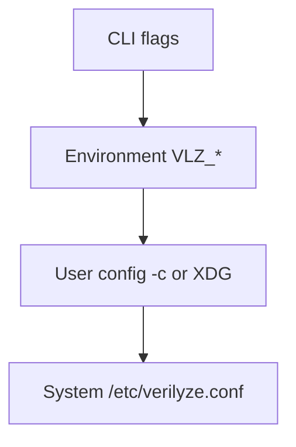

<!--
SPDX-FileCopyrightText: 2026 Travis Post <post.travis@gmail.com>

SPDX-License-Identifier: GPL-3.0-or-later
-->

# verilyze Configuration Reference (DOC-003)

This document describes every configuration key, its default value, accepted
types, corresponding environment variable, and CLI flag. See also
[verilyze.conf.example](../verilyze.conf.example) for a commented example
file, and `man verilyze.conf` for the man page. Run `vlz config --example` to
output a personalized example with effective values for your environment.

## Configuration precedence

Options are resolved in precedence order; each source overrides the ones below:



1. **CLI flags** (e.g. `--parallel 20`, `--cache-ttl-secs 86400`) -- highest
2. **Environment variables** `VLZ_*` (e.g. `VLZ_PARALLEL_QUERIES=20`)
3. **User config** (`-c/--config <path>` or `$XDG_CONFIG_HOME/verilyze/verilyze.conf`)
4. **System config** (`/etc/verilyze.conf`) -- lowest

## Scalar options

| Key | Type | Default | Env var | CLI flag |
|-----|------|---------|---------|----------|
| cache_db | string |  | `VLZ_CACHE_DB` | `--cache-db` |
| ignore_db | string |  | `VLZ_IGNORE_DB` | `--ignore-db` |
| parallel_queries | integer | 10 | `VLZ_PARALLEL_QUERIES` | `--parallel` |
| parallel_resolutions | integer | 4 | `VLZ_PARALLEL_RESOLUTIONS` | `--parallel-resolutions` |
| scan_exclude_dirs | string | .git,.venv,venv,node_modules,target,__pycache__,.tox,.eggs,dist,build,site-packages | `VLZ_SCAN_EXCLUDE_DIRS` | `--scan-exclude-dir (repeatable)` |
| reachability_mode | string | tier-b | `VLZ_REACHABILITY_MODE` | `--reachability-mode` |
| cache_ttl_secs | integer | 432000 | `VLZ_CACHE_TTL_SECS` | `--cache-ttl-secs` |
| min_score | float | 0 | `VLZ_MIN_SCORE` | `--min-score` |
| min_count | integer | 0 | `VLZ_MIN_COUNT` | `--min-count` |
| exit_code_on_cve | integer | 86 | `VLZ_EXIT_CODE_ON_CVE` | `--exit-code` |
| fp_exit_code | integer | 0 | `VLZ_FP_EXIT_CODE` | `--fp-exit-code` |
| project_id | string |  | `VLZ_PROJECT_ID` | `--project-id` |
| backoff_base_ms | integer | 100 | `VLZ_BACKOFF_BASE_MS` | `--backoff-base` |
| backoff_max_ms | integer | 30000 | `VLZ_BACKOFF_MAX_MS` | `--backoff-max` |
| max_retries | integer | 5 | `VLZ_MAX_RETRIES` | `--max-retries` |
| provider_http_connect_timeout_secs | integer | 15 | `VLZ_PROVIDER_HTTP_CONNECT_TIMEOUT_SECS` | `--provider-http-connect-timeout-secs` |
| provider_http_request_timeout_secs | integer | 120 | `VLZ_PROVIDER_HTTP_REQUEST_TIMEOUT_SECS` | `--provider-http-request-timeout-secs` |
| tls_crl_bundle | string |  | `VLZ_TLS_CRL_BUNDLE` | `--tls-crl-bundle` |
| keep_ephemeral_venv | boolean | false | `VLZ_KEEP_EPHEMERAL_VENV` | `--keep-ephemeral-venv` |
| allow_dependency_code_execution | boolean | false | `VLZ_ALLOW_DEPENDENCY_CODE_EXECUTION` | `--allow-dependency-code-execution` |
| allow_direct_only_fallback | boolean | false | `VLZ_ALLOW_DIRECT_ONLY_FALLBACK` | `--allow-direct-only-fallback` |
| fail_fast | boolean | false | `VLZ_FAIL_FAST` | `--fail-fast` |

## Severity thresholds (FR-013)

CVSS score thresholds for mapping to severity labels (CRITICAL, HIGH, MEDIUM,
LOW, UNKNOWN). Configurable per CVSS version (v2, v3, v4) via
`[severity.v2]`, `[severity.v3]`, `[severity.v4]` sections.

| Version | critical_min | high_min | medium_min | low_min |
|---------|--------------|----------|------------|--------|
| v2 | 9 | 7 | 4 | 0.1 |
| v3 | 9 | 7 | 4 | 0.1 |
| v4 | 9 | 7 | 4 | 0.1 |

## Per-language manifest regex (FR-006)

Override which files are treated as manifests per language. Use
`[python]`, `[rust]`, `[go]`, etc. with a `regex` key:

```toml
[python]
regex = "^requirements\\.txt$"

[rust]
regex = "^Cargo\\.toml$"

[go]
regex = "^go\\.mod$"
```

Use `vlz config --set python.regex="^requirements\\.txt$"` to set via CLI.
First match wins when multiple patterns could match.

## Reachability (FR-032)

`reachability_mode` accepts `off`, `tier-b`, or `best-available`. The
`best-available` value enables Tier C (advisory symbol/path metadata) where the
language analyzer supports it.

Environment-only: set `VLZ_REACHABILITY_PERSIST_CACHE=1` (or `true`/`yes`) to
persist Tier B and per-CVE Tier C decisions under `.vlz/reachability-cache.json`
in the scan root. See `man vlz` ENVIRONMENT and CONTRIBUTING.md.

## Python resolution policy (FR-022, SEC-023)

`allow_dependency_code_execution` (default false) and
`allow_direct_only_fallback` (default false) apply to **all** Python project
manifests (`requirements.txt`, `pyproject.toml`, `Pipfile`, `setup.cfg`,
`setup.py`). Lock-less projects fail closed (exit 2) unless an adjacent lock
is present (PEP 751 `pylock.toml` / `pylock.<name>.toml` preferred), safe
`pip lock -r` succeeds for requirements.txt (pip >= 25.1), executable
resolution is opted in, or direct-only fallback is opted in. There is no soft
direct-only default for pyproject/setup/Pipfile. See
[docs/FAQ.md](FAQ.md) and `man vlz`.

## See also

- [verilyze.conf.example](../verilyze.conf.example) -- commented example (or run `vlz config --example` for a personalized copy)
- `man verilyze.conf` -- man page
- [README.md](../README.md) -- quick start and CLI reference
- [architecture/PRD.md](../architecture/PRD.md) -- CFG-001 through CFG-008
