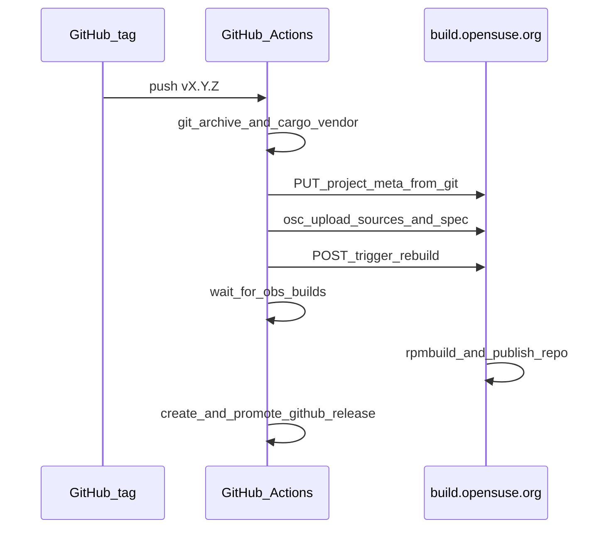

<!--
SPDX-FileCopyrightText: 2026 Travis Post <post.travis@gmail.com>

SPDX-License-Identifier: GPL-3.0-or-later
-->

# OBS packaging workflow

This directory contains canonical packaging metadata for builds on
build.opensuse.org (OBS).

## Public OBS: upload-driven releases

`build.opensuse.org` does **not** provide the `cargo_vendor` or `tar` source
services on its workers. This project therefore publishes RPMs by uploading
prepared sources from GitHub Actions on every `v*` tag, then triggering an OBS
rebuild only.



Each release uploads into the configured OBS package:

- `verilyze-X.Y.Z.tar.xz` (`Source0`)
- `vendor.tar.zst` (`Source1`)
- `verilyze.spec` with `Version: X.Y.Z`
- `verilyze.changes` with a release entry derived from the matching
  `CHANGELOG.md` section (OBS injects this into built RPM changelogs on
  openSUSE targets; the spec `%changelog` section stays empty)

The legacy non-standard `verilyze.spec.changes` filename is removed on upload
when present on the OBS package.

Prior `${OBS_PACKAGE}-*.tar.xz` source archives are removed on upload, leaving
only the current release tarball.

The OBS package should **not** include a `_service` file on public OBS. Delete
any existing `_service` on the OBS package once before switching to this flow
(one-time maintainer action).

### Required GitHub secrets

- `OBS_USER` -- OBS account for `osc` upload
- `OBS_PASSWORD` -- OBS password or API token for `osc` upload
- Release automation maps `OBS_USER` / `OBS_PASSWORD` into a transient per-run
  `oscrc` (mode `600`, deleted after upload). Ubuntu apt `osc` requires an
  apiurl-named section with `user` and `pass`; it does not honor `OSC_*` env
  vars alone.
- `OBS_TOKEN_REBUILD` -- for `POST .../trigger/rebuild` on `build.opensuse.org`

Create the rebuild token with `osc` (or the OBS web UI) scoped to the package:

```bash
osc token --create --operation rebuild home:tpost:verilyze verilyze
```

`OBS_TOKEN_RUNSERVICE` is **not** used for public OBS releases.

### Automation scripts

On tag push, [`.github/workflows/release.yml`](../../.github/workflows/release.yml)
runs:

1. [`scripts/sync-obs-project-meta.sh`](../../scripts/sync-obs-project-meta.sh)
   `--push` -- applies committed [`packaging/obs/project/_meta`](project/_meta)
   to OBS before upload.
2. [`scripts/obs-upload-release-sources.sh`](../../scripts/obs-upload-release-sources.sh)
   -- builds `verilyze-X.Y.Z.tar.xz`, `vendor.tar.zst`, stamped
   `verilyze.spec`, and `verilyze.changes` (via
   [`scripts/render_obs_changes.py`](../../scripts/render_obs_changes.py)),
   then uploads with `osc`.
3. [`scripts/obs-trigger-build.sh`](../../scripts/obs-trigger-build.sh)
   `--skip-runservice` -- triggers rebuild only.
4. [`scripts/obs-wait-for-builds.sh`](../../scripts/obs-wait-for-builds.sh)
   -- polls OBS until enabled build repositories (derived from committed
   `_meta` files) succeed. The release workflow runs this before creating or
   promoting the GitHub Release.

Local dry-run (builds artifacts, no upload):

```bash
make obs-upload-dry-run VERSION=0.2.1
```

## Coordinates and namespace migration

OBS project/package coordinates are defined in one place:
`packaging/obs/obs-project.env`.

- `OBS_PROJECT` defaults to `home:tpost:verilyze`
- `OBS_PACKAGE` defaults to `verilyze`

To migrate from a personal namespace to a project-maintained namespace, update
`obs-project.env` first, then update OBS-side metadata as needed.

## Build targets (enabled distros)

Git is the single source of truth for which OBS build repositories are enabled.

- [`packaging/obs/project/_meta`](project/_meta) -- project-level repository
  definitions (canonical; pushed to OBS on every release).
- [`packaging/obs/rpm/_meta`](rpm/_meta) -- package metadata; repo-level build
  disables (if any) are subtracted when deriving the wait list.

[`scripts/obs_repositories.py`](../../scripts/obs_repositories.py) parses those
files offline for `obs-wait-for-builds.sh` and `make check-obs-packaging`.

Maintainer workflow when adding or removing a build target:

1. Edit `packaging/obs/project/_meta` in a PR (add/remove `<repository>`
   elements with correct `<path>` and `<arch>` entries).
2. Merge and tag; `release.yml` runs
   [`scripts/sync-obs-project-meta.sh`](../../scripts/sync-obs-project-meta.sh)
   `--push` before source upload.
3. Optional local commands (require `OBS_USER` / `OBS_PASSWORD`):
   - `./scripts/sync-obs-project-meta.sh --push` -- apply git meta to OBS
   - `./scripts/sync-obs-project-meta.sh --check` -- fail on drift vs live OBS
   - `./scripts/sync-obs-project-meta.sh --pull` -- bootstrap/recover committed
     meta from OBS (one-time or after out-of-band OBS UI edits)

Do not edit project repositories in the OBS web UI as the primary workflow.

## Layout

- `packaging/obs/_service` -- legacy source-service definition for private OBS
  or local `osc service` use (not used on build.opensuse.org).
- `packaging/obs/rpm`
  - `_service` symlink to `../_service`
  - `_meta` for OBS package metadata
  - `verilyze.spec` for RPM targets (Fedora, RHEL, Rocky, openSUSE, SLE)
  - `verilyze.changes` seed history for first upload when OBS has no
    `.changes` file yet
- `packaging/obs/debian`
  - `_service` symlink to `../_service`
  - `_meta` for OBS package metadata
  - `debian/` canonical Debian packaging metadata for Debian and Ubuntu

## Vendor archive layout

GitHub Actions runs `cargo vendor` and packs `vendor.tar.zst` with:

- `.cargo/config.toml` (crates-io replaced by `vendor/`)
- `vendor/`
- `Cargo.lock`

The RPM spec and Debian `debian/rules` extract `vendor.tar.zst` atop the unpacked
upstream tree, then run `cargo build --release --locked --offline`.

Because `vendor.tar.zst` keeps a fixed filename on OBS (unlike the versioned
upstream tarball), release upload verifies it in two layers:

1. **Pre-upload content gate** -- [`scripts/obs_upload_verify.py`](../../scripts/obs_upload_verify.py)
   extracts `Cargo.lock` from the built vendor archive and compares it to
   `git show <ref>:Cargo.lock` before `osc commit`.
2. **Post-upload integrity gate** -- after `osc commit`, the upload script
   compares SHA-256 digests of the OBS checkout files (and OBS `.osc/_files`
   metadata when present) to the locally built artifacts.

Checksum verification closes the packaging handoff gap (stale or mismatched
vendor bytes on OBS). It does not replace dependency policy checks (`cargo deny`,
committed `Cargo.lock` curation in CI). Signing `vendor.tar.zst` before upload is
not used: OBS does not validate maintainer signatures on source files; published
RPM/DEB trust is covered by OBS repository signing (below).

## Signing policy and verification

OBS repositories on `build.opensuse.org` are signed with an OBS project key.
For `verilyze`, this means the trust anchor is the key published for the
configured `OBS_PROJECT` in `packaging/obs/obs-project.env`.

Signing key sources:

- OBS web page:
  `https://build.opensuse.org/projects/<OBS_PROJECT>/signing_keys`
- OBS CLI:
  `osc signkey <OBS_PROJECT>`

Before trusting packages, verify that the published key fingerprint matches the
expected project key fingerprint you have recorded out-of-band for your release
process.

Suggested user verification:

- RPM ecosystems:
  - Import project key from OBS (`osc signkey <OBS_PROJECT> | rpm --import -`)
  - Verify package signature (`rpm --checksig <package.rpm>`)
- Debian/Ubuntu ecosystems:
  - Add the OBS project key to an apt keyring and use `signed-by=...` in the
    source list entry.
  - Verify repository metadata signatures during `apt update`.

Key rotation and expiration:

- Extend key lifetime with:
  `osc signkey --extend <OBS_PROJECT>`
- After extending or rotating keys, trigger OBS publish/rebuild so updated key
  metadata is visible in published repos.
- Run `make check-obs-packaging` to validate that OBS signing key metadata is
  present and structurally valid for the configured project.

## Versioning

The root workspace version in `Cargo.toml` remains the source of truth. Release
tags follow `vX.Y.Z`. OBS upload automation receives `X.Y.Z` from the release
workflow and logs it for traceability.

## RPM dual-spec maintenance

This repository intentionally keeps two RPM spec files:

- `packaging/obs/rpm/verilyze.spec` is the source of truth for OBS builds.
- `packaging/rpm/SPECS/verilyze.spec` is the local `rpmbuild` variant.

The local spec is generated from the OBS spec with explicit divergence points
only for local packaging behavior (source format, version macro handling, and
offline vendor extraction differences).

Use:

- `make sync-rpm-specs` to regenerate `packaging/rpm/SPECS/verilyze.spec`
- `make check-rpm-spec-sync` to verify no drift in CI/local checks

Reassess this approach after 2-3 release cycles. If maintenance cost
remains high, evaluate moving to an explicit generator-first option workflow.

## cargo-deb convenience path

`cargo-deb` remains available for local convenience artifacts (`make deb`), but
canonical distro Debian metadata for OBS is under
`packaging/obs/debian/debian`.

`make check-obs-packaging` validates:

- OBS coordinates are present in `obs-project.env`
- Debian package name remains `verilyze`
- `cargo-deb` metadata block remains present in `crates/core/vlz/Cargo.toml`
- OBS RPM spec uses offline cargo with `vendor.tar.zst`
- OBS RPM spec keeps an empty `%changelog` section (history lives in
  `verilyze.changes`)
- Release workflow invokes project meta sync (`--push`), upload script,
  rebuild-only OBS trigger, and OBS build wait before GitHub Release promotion
- OBS upload script verifies vendor `Cargo.lock` before upload and artifact
  SHA-256 checksums after `osc commit`
- Committed `packaging/obs/project/_meta` exists and yields a non-empty enabled
  repository list
- OBS signing key metadata is published for the configured project
- `obs-project.env` defines `OBS_CHANGES_FILENAME`, `OBS_LEGACY_CHANGES_FILENAME`,
  and `OBS_MAINTAINER` for automation

## Appendix: private OBS / local source services

The file `packaging/obs/_service` documents an OBS source-service pipeline
(`obs_scm`, `cargo_vendor`, `tar`, `recompress`, `set_version`) suitable for
OBS instances where those services are installed. That pipeline is **not**
used on `build.opensuse.org` for this project.

For local experimentation on a private OBS instance:

```bash
osc service runall
osc commit
```

Ensure `obs-service-cargo` and related packages are installed on the OBS
source-service workers before relying on `_service`.
